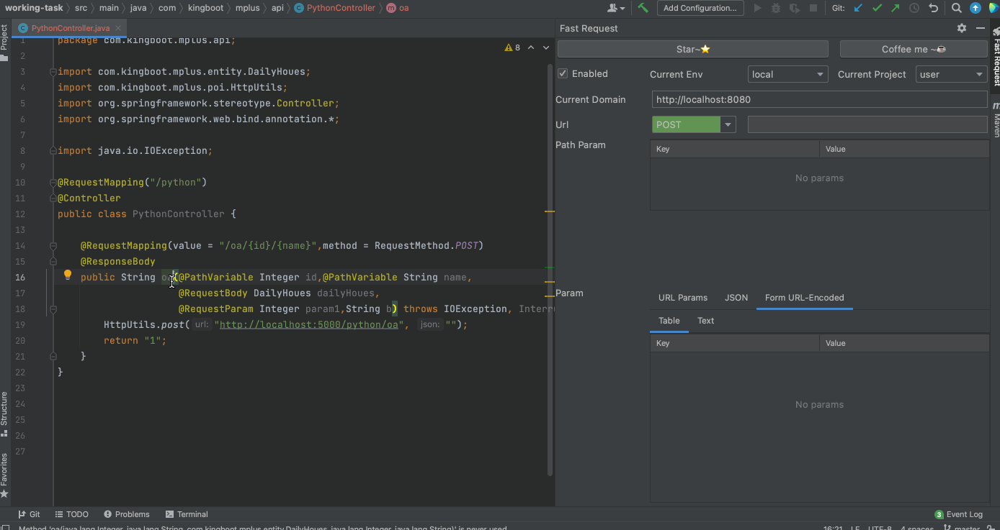
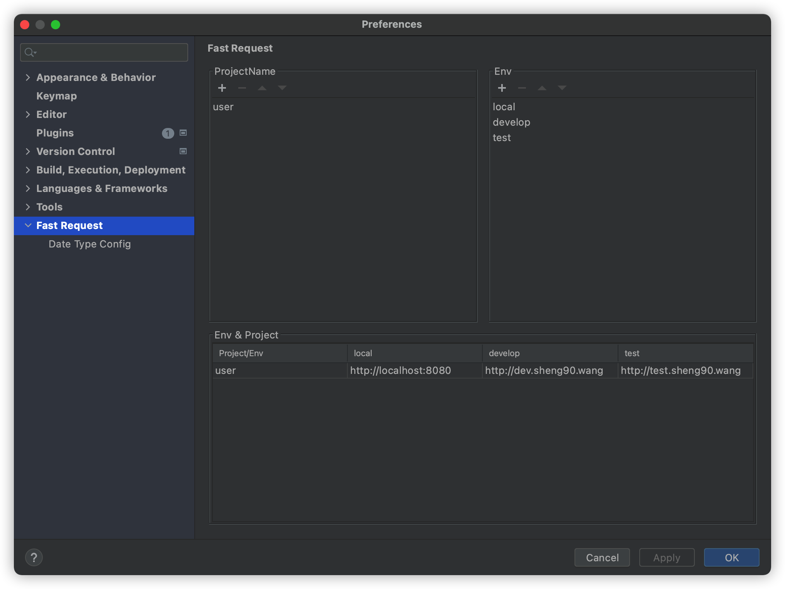
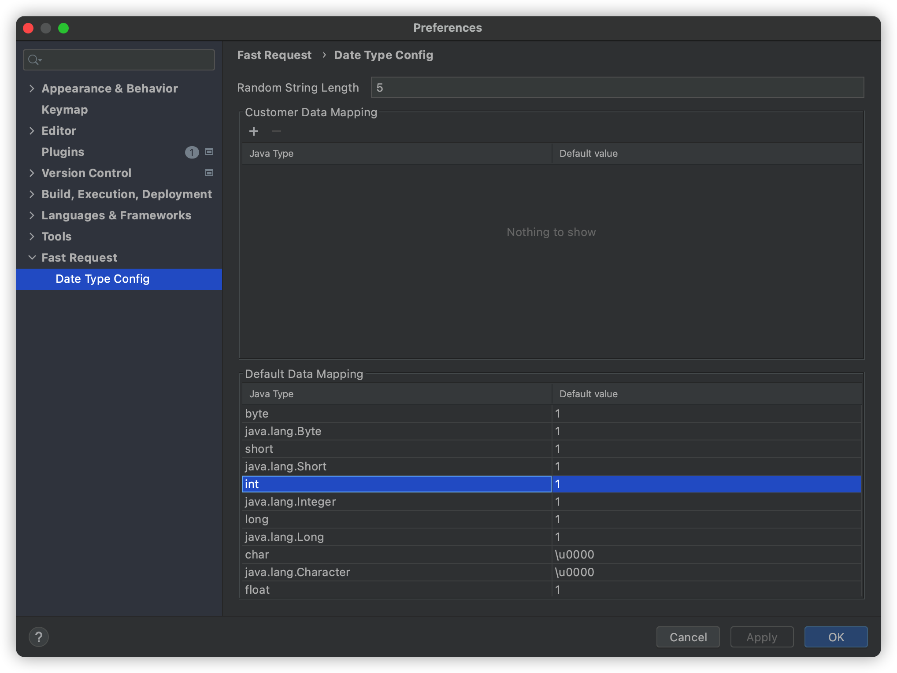

# Fast Request

[![Jetbrains Plugins][plugin-img]][plugin]


**Fast Request** is a plugin based on springmvc that help you quickly generate **url** and **params**.

Just press the shortcut key,Plugin will give you the result

The plugin UI references [Paw](https://paw.cloud/)

If you think this plugin help you, please **🌟Star** project, and also welcome to provide excellent pull request



- document
    * [中文文档](README.zh_CN.md)
    * [English Document](README.md)

QQ group:754131222  
  
## 1.Install
**using IDE plugin system**
- <kbd>Preferences(Settings)</kbd> > <kbd>Plugins</kbd> > <kbd>Browse repositories...</kbd> > <kbd>find"Fast Request"</kbd> > <kbd>Install Plugin</kbd>

**Manual:**
- download[`lastest plugin zip`][latest-release] -> <kbd>Preferences(Settings)</kbd> > <kbd>Plugins</kbd> > <kbd>Install plugin from disk...</kbd>


## 2.Default shortcut key

|key|scope|description|
| --- | --- | --- |
| <kbd> ctrl \ </kbd> | method(just put the cursor on method) | Generate the url and request parameters of the current method |

if it doesn't work,you can search <kbd>Generate URL and Param</kbd> in key map and change the key

modify key:<kbd>Preferences(Settings)</kbd> > <kbd>Keymap</kbd>

other way:<kbd>Code(Toolbar)</kbd> > <kbd>Generate</kbd> > <kbd>Generate URL and Param</kbd>


## 3.config and usage
### 3.1 common config
|config name|description|
| --- | --- |
|ProjectName|project name,Example:**user**、**order**,Please make sure there must be a project before adding env|
|Env|environment Name,Example:**local**、**develop**、**test**、**produce**|
|Domain|add the domain url in table|



### 3.2 Data Mapping
|config name|description|
| --- | --- |
|Random String Length|Random string length,default 5|
|Custom Data Mapping|If you want a class to parse only the fields you want,then you can add custom mapping configuration|
|Default Data Mapping|Default type of relational mapping,That is, the type is converted to the corresponding value|



#### 3.2.1 Custom Data Mapping
**Java Type**is the corresponding object type,must contain package name and class name

Example:`com.baomidou.mybatisplus.extension.plugins.pagination.Page`

**Default value**must be in json format,

Example:
```
{"size":10,"current":1}
```

## 4.Tips
1. The parameter Table supports value modification,  the URL will change when Path Param Table params has been modified.
2. Url Param、JSON、Form URL-Encoded Table support parameter modification,after modify,text tab parameters will also change accordingly,**right click in textarea to copy parameters**
## 5.Type Icon Mapping
icon and type mapping

|Icon|Type|
| --- | --- | 
|  |Array  |
| |Object |
| |Number |
| |String |
||Boolean|

## 6.Updates
- v1.0.0(2021.06.09)
  * support generate url and param
  * support custom domain
  * support custom params

## 7.Donate
If you think the plug-in is great and saves you a lot of time, then invite the author to have a cup of coffee~☕☕☕,thank you very much!

|  |  |
| --- | --- |

## 8.Plan
I very hope you can help build follow-up functions.Provide good idea and provide good PR!

* support send request


[latest-release]: https://github.com/kings1990/fast-request/releases/latest
[plugin]: https://plugins.jetbrains.com/plugin/16988
[plugin-img]: https://img.shields.io/badge/plugin-FastRequest-x.svg