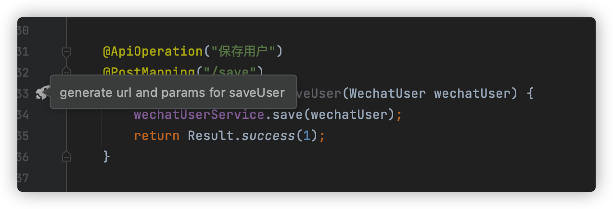
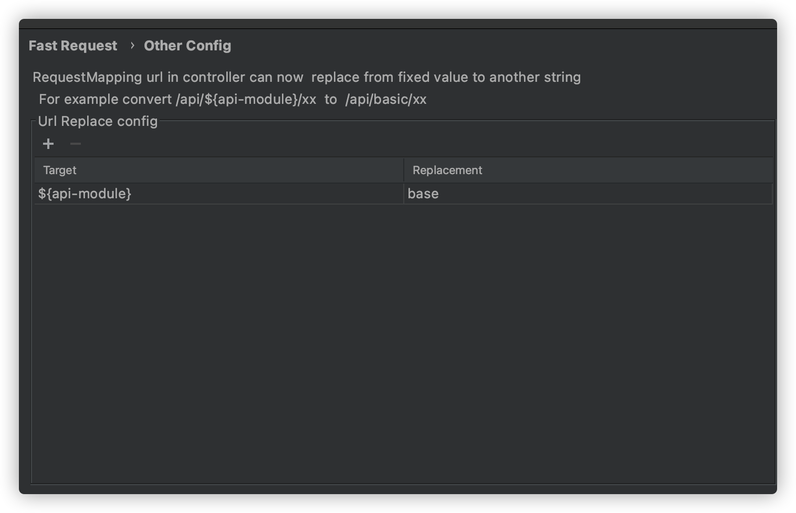

# Restful Fast Request

[![Jetbrains Plugins][plugin-img]][plugin]


[](https://fastrequest.slack.com)

[**Restful Fast Request**](https://plugins.jetbrains.com/plugin/16988-fast-request) is a plugin based on springmvc that
help you quickly generate **url** and **params**.It is also a http client tool.

You only need to click the rocket icon on the left side of the method, the plugin will help you generate the method url
and parameters and display in the tool window, and then click Send Request to complete the API debugging in IDEA, and
you can save the history request

Compared with the HTTP Client, Restful Fast Request not only has the built-in functions of the HTTP Client, but also
provides a friendly, easy-to-understand and intuitive interface, which makes it more convenient and simple for users to
debug the API. At the same time, various types of parameters also provide different customization methods to make it
more flexible.

> PURPOSE  
> The purpose of the plug-in is to simplify development and improve efficiency. Our vision is to become the best partner of IDEA, just like Contra's 1P, 2P, base-friend collocation, and double the efficiency.

If you think this plugin help you, please **🌟Star** project, and also welcome to provide excellent recommendation

## Features

* generate url and parameters in one click
* Send request to debug API(support to modify the generated parameters)
* domain customization and switching
* custom parameter parse
* string generation strategy
* save api
* Management API (search filter, modify API name)
* one click location history save api to method
* api to curl


- document
  * [中文文档](https://kings1990.github.io/restful-fast-request-doc/)
  * [English Document](https://kings1990.github.io/restful-fast-request-doc/en/)

## 0.Install

**using IDE plugin system**

- recommended <kbd>Preferences(Settings)</kbd> > <kbd>Plugins</kbd> > <kbd>Browse repositories...</kbd> > <kbd>find"
  Restful Fast Request"</kbd> > <kbd>Install Plugin</kbd>

**Manual:**

- download[`lastest plugin zip`][latest-release] -> <kbd>Preferences(Settings)</kbd> > <kbd>Plugins</kbd> > <kbd>Install
  plugin from disk...</kbd>

## 1.How to use

```
Step1:Click Manager config then add project name[example:wx card] and env[example:local、dev]
Step2:set target domain
Step3:open toolwindow(at the top-right corner),select project and env
Step4:click fastRequest icon on method left(generate url and param)
Step5:click send button for sending request
```


## 2.Default shortcut key
recommend way:just click FastRequest icon



[comment]: <> (|key|scope|description|)

[comment]: <> (| --- | --- | --- |)

[comment]: <> (| <kbd> ctrl \ </kbd> | method&#40;just put the cursor on method&#41; | Generate the url and request parameters of the current method |)

[comment]: <> (if it doesn't work,you can search <kbd>Generate URL and Param</kbd> in key map and change the key)

[comment]: <> (modify key:<kbd>Preferences&#40;Settings&#41;</kbd> > <kbd>Keymap</kbd>)

[comment]: <> (other way:<kbd>Code&#40;Toolbar&#41;</kbd> > <kbd>Generate</kbd> > <kbd>Generate URL and Param</kbd>)


## 3.config and usage
### 3.1 common config
|config name|description|
| --- | --- |
|ProjectName|project name,Example:**user**、**order**,Please make sure there must be a project before adding env|
|Env|environment Name,Example:**local**、**develop**、**test**、**produce**|
|Domain|add the domain url in table|


### 3.2 Data Mapping
|config name|description|
| --- | --- |
|Random String Length|Random string length,default 5|
|Custom Data Mapping|If you want a class to parse only the fields you want,then you can add custom mapping configuration|
|Default Data Mapping|Default type of relational mapping,That is, the type is converted to the corresponding value|


#### 3.2.1 Custom Data Mapping
**Java Type**is the corresponding object type,must contain package name and class name

Example:`com.baomidou.mybatisplus.extension.plugins.pagination.Page`

**Default value**must be in json format,

Example:
```
{"size":10,"current":1}
```

#### 3.3 Other config
controller url fixed variable can replace by config, For example controller like this

```
@RequestMapping("/api/${api-module}/user")
@Controller
public class XxxController(){
  ...
}
```

the actual url is `/api/base/user`

Then `${api-module}` can be replaced by the following configuration


## 4.Type Icon Mapping
icon and type mapping

|Icon|Type|
| --- | --- | 
|  |Array  |
| |Object |
| |Number |
| |String |
||Boolean|
||File|


## 5.Donate
If you think the plug-in is great and saves you a lot of time, then invite the author to have a cup of coffee~☕☕☕,thank you very much!

|  |  |
| --- | --- |

## 6.FAQ
>Question 1:About the console blocking the tool window  
Answer:At present, when the tool window and console are visible at the same time, It does not support the display of tool windows prior to the console. So you can only adjust [view mode](https://www.jetbrains.com/help/idea/viewing-modes.html)
to control the view,Or use shortcut keys to quickly hide and show the console(shortcut:look at view->toolWindow->run/debug) to make all the content in the tool window visible。Of course, you can click to hide the Request part to see the Response

>Question 2:Why the plugin doesn't respond  
Answer:Please configure the relevant configuration according to the steps introduced in the first chapter first, and then click the icon

>Question 3:idea freezes after clicking the icon  
>Answer:The entity class you designed is nested and recursive, the plugin does not support

[latest-release]: https://github.com/kings1990/fast-request/releases/latest
[plugin]: https://plugins.jetbrains.com/plugin/16988

[plugin-img]: https://img.shields.io/badge/plugin-Restful_Fast_Request-x.svg