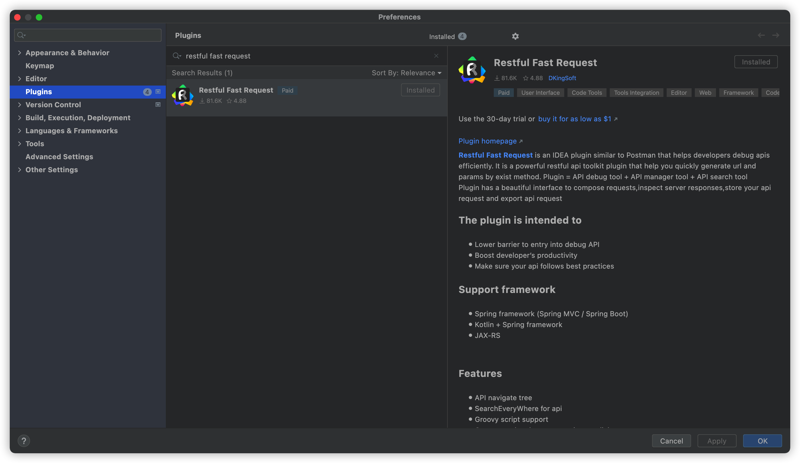

# Restful Fast Request

* [简体中文](./README.zh_CN.md)
* Version before v2022.1.4

[![Jetbrains Plugins][plugin-img]][plugin]

[**Restful Fast Request**](https://plugins.jetbrains.com/plugin/16988-fast-request) is the IDEA version of Postman,it is a powerful restful api toolkit plugin(http client) help you quickly generate url and params by exist method.`Plugin = API debug tool + API manager tool + API search tool` 
It has a beautiful interface to compose requests,inspect server responses,store your api request and export api request.Plugin help you debug request just in Intellij frame

Compared with the HTTP Client, Restful Fast Request not only has the built-in functions of the HTTP Client, but also
provides a friendly, easy-to-understand and intuitive interface, which makes it more convenient and simple for users to
debug the API. At the same time, various types of parameters also provide different customization methods to make it
more flexible.And it integrates additional features such as search, Postman integration, Swagger support and so on.

> Supported framework
>>Spring framework (Spring MVC / Spring Boot)  
>>JAX-RS

> PURPOSE  
>> The purpose of the plug-in is to simplify development and improve efficiency. Our vision is to become the best partner of IDEA, just like Contra's 1P, 2P, base-friend collocation, and double the efficiency.

If you think this plugin help you, please **🌟Star** project, and also welcome to provide excellent recommendation

## Features

* API navigate tree
* SearchEveryWhere for api
* APIs export to Postman
* Generate url and parameters in one click
* Send request to debug API(support to modify the generated parameters)
* Domain customization and switching
* Custom parameter parse
* String generation strategy
* Save api
* Management API (search filter, modify API name)
* One click location history save api to method
* Api to curl
* Automatically associate APIs to module groups
* Built-in Json parameter editor

> Send request

> SearchEveryWhere for api

> Send and download

> Api manage

> Api navigate

> Api export to postman

> Api list preview

# Document

* [中文文档](https://plugins.sheng90.wang/fast-request)
* [English Document](https://dromara.github.io/fast-request/en)

## Install

**using IDE plugin system**

- recommended <kbd>Preferences(Settings)</kbd> > <kbd>Plugins</kbd> > <kbd>Browse repositories...</kbd> > <kbd>type in"Restful Fast Request"</kbd> > <kbd>Install Plugin</kbd>

[latest-release]: https://github.com/dromara/fast-request/releases/latest

[plugin]: https://plugins.jetbrains.com/plugin/16988

[plugin-img]: https://img.shields.io/badge/plugin-Restful_Fast_Request-x.svg?logo=IntelliJ%20IDEA