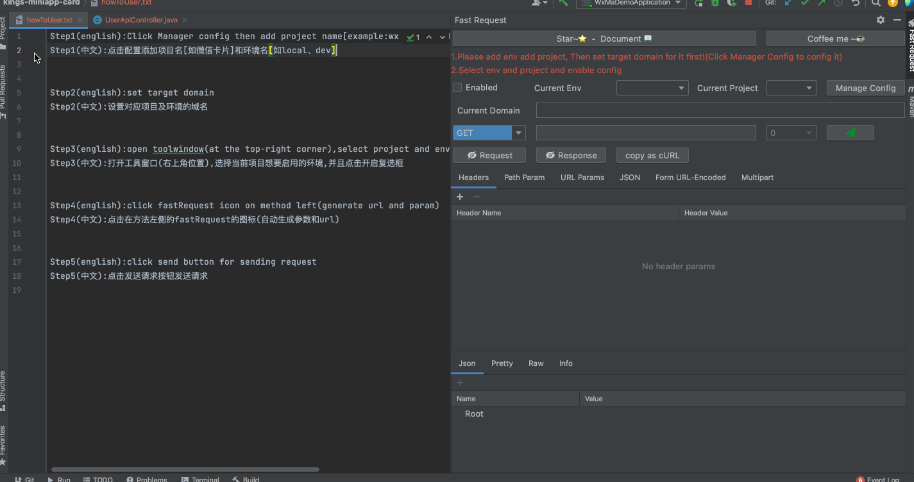
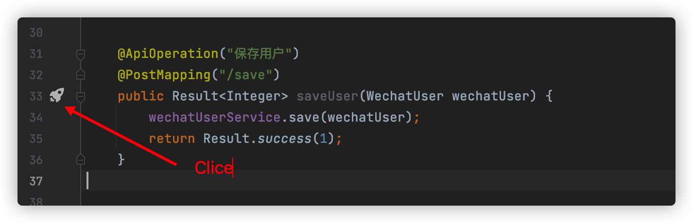
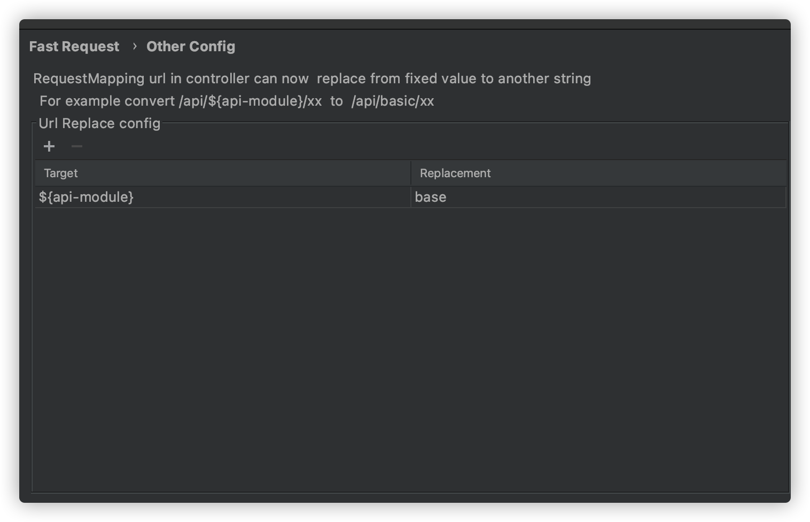

# Restful Fast Request

[![Jetbrains Plugins][plugin-img]][plugin]


[](https://qm.qq.com/cgi-bin/qm/qr?k=1OEJ5QST4zoEUv0x0OvOmC3TUfAIZXAO)
[](https://fastrequest.slack.com)

[**Restful Fast Request**](https://plugins.jetbrains.com/plugin/16988-fast-request) 是一个基于springmvc的帮助你快速生成**url**和**参数**
的IDEA 插件。同时也是一个http client工具，你只需要按一下方法左侧的小图标(小火箭),插件就会帮你生成方法的url和参数显示在工具窗口，再点击发送请求即可在IDEA内完成API调试，并且可以保存历史请求，方便再次使用调试

对比与HTTP Client，Fast Request不仅拥有HTTP Client内置的功能，还提供了友好易懂直观的界面，让使用者调试API的时候能够更加方便、简捷，同时各种类型参数也提供了不同的定制方式，更加灵活。

> 宗旨  
> 插件的宗旨是为简化开发、提高效率而生，我们的愿景是成为 IDEA 最好的搭档，就像魂斗罗中的 1P、2P，基友搭配，效率翻倍。

如果你觉得本插件不错,请给个🌟Star吧,也欢迎提供宝贵的建议

## 功能

* 一键生成url和参数
* 发送请求调试API(支持修改生成的参数)
* 域名定制及切换
* 自定义参数解析
* 字符串生成策略化
* 保存API
* 管理API(搜索过滤、修改API名称)
* 一键定位历史保存的API到方法
* API转curl


- document
  * [中文文档](https://kings1990.github.io/restful-fast-request-doc/)
  * [English Document](https://kings1990.github.io/restful-fast-request-doc/en/)

# QQ 群:754131222

有问题也可以在群里交流

## 0.安装

**插件市场安装**

- 推荐 <kbd>Preferences(Settings)</kbd> > <kbd>Plugins</kbd> > <kbd>Browse repositories...</kbd> > <kbd>输入"Fast
  Request"</kbd> > <kbd>点击Install</kbd>

**手动安装:**

- 下载[`lastest plugin zip`][latest-release] -> <kbd>Preferences(Settings)</kbd> > <kbd>Plugins</kbd> > <kbd>Install
  plugin from disk...</kbd>

## 1.如何使用
```
Step1:点击配置添加项目名[如微信卡片]和环境名[如local、dev]
Step2:设置对应项目及环境的域名
Step3:打开工具窗口(右上角位置),选择当前项目想要启用的环境
Step4:点击在方法左侧的fastRequest的图标(自动生成参数和url)
Step5:点击发送请求按钮发送请求
```



## 2.默认快捷键
推荐用法:点击图标


[comment]: <> (也可通过IDEA快捷键设置修改)

[comment]: <> (|快捷键|作用域|说明|)

[comment]: <> (| --- | --- | --- |)

[comment]: <> (| <kbd> ctrl \ </kbd> | 方法&#40;光标放上面就行&#41; | 生成当前方法的url和请求参数 |)

[comment]: <> (如果它不起作用，您可以在Keymap中搜索<kbd>Generate URL and Param</kbd>并更改快捷键)

[comment]: <> (修改路径:<kbd>Preferences&#40;Settings&#41;</kbd> > <kbd>Keymap</kbd>)

[comment]: <> (另外的方法:<kbd>Code&#40;Toolbar&#41;</kbd> > <kbd>Generate</kbd> > <kbd>Generate URL and Param</kbd>)

## 3.配置及使用

### 3.1 公共配置
|配置名|描述|
| --- | --- |
|ProjectName|项目名,如user、order等,请确保必须先有一个project再添加env|
|Env|环境名,如local、develop、test、produce等|
|Domain|在表格中维护对应项目对应环境的域名|


### 3.2 数据映射
|配置名|描述|
| --- | --- |
|Random String Length|随机出的字符串长度,默认为5|
|Custom Data Mapping|如果你想要一个类只解析自己想要的字段,那么你可以通过添加自定义的映射配置|
|Default Data Mapping|默认类型的关系映射,即类型转化为对应的值|


#### 3.2.1 Custom Data Mapping
**Java Type**为对应的对象类型,必须是包含包名和类名,如`com.baomidou.mybatisplus.extension.plugins.pagination.Page`

**Default value**必须是json格式,如
```
{"size":10,"current":1}
```

### 3.3 其他配置

控制器上的url固定变量可以由配置替换,例如类控制器上url写法如下

```
@RequestMapping("/api/${api-module}/user")
@Controller
public class XxxController(){
  ...
}
```

实际的url是`/api/base/user`

那么可以通过以下配置来替换`${api-module}`变量



## 4.类型ICON映射
图标和类型映射关系

|Icon|Type|
| --- | --- | 
|  |Array  |
| |Object |
| |Number |
| |String |
||Boolean|
||File|

## 5.支持作者
如果觉得插件很赞，为你节约了不少时间，那么就请作者喝杯咖啡吧~☕☕☕,非常感谢

|  |  |
| --- | --- |

## 6.FAQ
>问题1:关于控制台挡住工具窗口  
答:目前官方在工具窗口和控制台同时可见时,不支持工具窗口的显示优先于控制台,所以你只能通过调整[视图模式](https://www.jetbrains.com/help/idea/viewing-modes.html)
来控制,或者通过快捷键来快速隐藏和显示控制台(快捷键:view->toolWindow->run/debug可见快捷键)，使得工具窗口中的内容全部可见。当然你可以点击隐藏Request部分来看Response

>问题2:为啥插件没反应  
答:请优先按照第一章节介绍的使用步骤配置相关的配置,再点击图标

>问题3:点击图标后idea卡死  
>答:你设计的实体类嵌套递归,插件不支持

[latest-release]: https://github.com/kings1990/fast-request/releases/latest
[plugin]: https://plugins.jetbrains.com/plugin/16988
[plugin-img]: https://img.shields.io/badge/plugin-Restful_Fast_Request-x.svg
