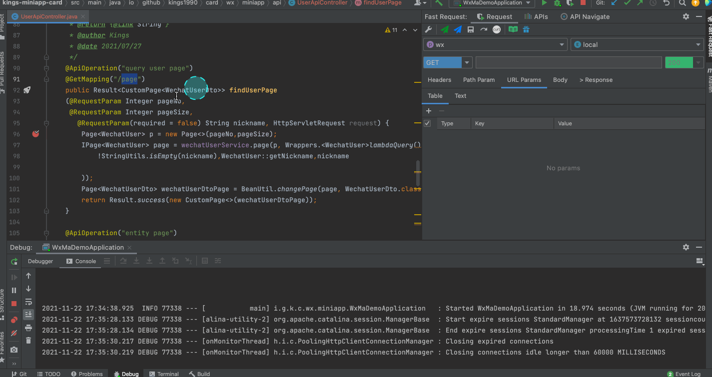

# Restful Fast Request

- Version before v2022.1.4

<a href="https://www.jetbrains.com"></a>
<a href="https://www.jetbrains.com/idea"></a>
<a href='https://gitee.com/dromara/fast-request'></img></a>

[](https://join.slack.com/t/restfulfastrequest/shared_invite/zt-1we57vum8-TALhTHI2uNmPF2bx1NDyWw)
[](https://twitter.com/FastRequest666)
[](https://github.com/dromara/fast-request)
[](https://gitee.com/dromara/fast-request)
[![Jetbrains Plugins][plugin-img]][plugin]


[](https://fastrequest.slack.com)
[](https://www.oscs1024.com/project/dromara/fast-request?ref=badge_small)

[**Restful Fast Request**](https://plugins.jetbrains.com/plugin/16988) 是 idea 版 Postman，它是一个强大的 restful api 工具包插件，可以根据已有的方法帮助您快速生成 url 和 params。`Restful Fast Request = API 调试工具 + API 管理工具 + API搜索工具`。
它有一个漂亮的界面来完成请求、检查服务器响应、存储你的 api 请求和导出 api 请求，插件帮助你在 IDEA 界面内更快更高效得调试你的 API。

对比于 HTTP Client，Fast Request 不仅拥有 HTTP Client 内置的功能，还提供了友好易懂直观的界面，让使用者调试 API 的时候能够更加方便、简捷。同时各种类型参数也提供了不同的定制方式，更加灵活。而且集成了搜索、Postman 集成，Swagger 支持等额外的功能。

> 支持的框架
>
> > Spring 系列框架(Spring MVC / Spring Boot)  
> > JAX-RS

> 宗旨
>
> > 插件的宗旨是为简化开发、提高效率而生，我们的愿景是成为 IDEA 最好的搭档，就像魂斗罗中的 1P、2P，基友搭配，效率翻倍。

# Document

- [中文文档](https://api-buddy.cn)
- [English Document](https://api-buddy.com/en/)

# 群聊

[https://api-buddy.cn/guide/concatGroup.html](https://api-buddy.cn/guide/concatGroup.html)

更快速得回复问题，可以加入微信群，同时也可以一起探讨研究技术问题

|  |
| ---------------------------------------------------------- |
| 如果扫码失败请直接搜微信号 FastRequest99                   |

## 功能

- API 导航树
- SearchEveryWhere 搜索 API
- API 导出到 Postman
- 一键生成 url 和参数
- 发送请求调试 API(支持修改生成的参数)
- 域名定制及切换
- 自定义参数解析
- 字符串生成策略化
- 保存 API
- 管理 API(搜索过滤、修改 API 名称)
- 一键定位历史保存的 API 到方法
- API 转 curl
- 自动将 API 关联到模块分组
- 内置 Json 参数编辑器

> 发送请求
> 

> SearchEveryWhere 搜索 API
> 

> 下载文件
> 

> Api 管理
> 

> Api 导航
> 

> Api 导出到 postman
> 

> Api 一览表
> 

## 安装

**插件市场安装**

- 推荐 <kbd>Preferences(Settings)</kbd> > <kbd>Plugins</kbd> > <kbd>Browse repositories...</kbd> > <kbd>输入"Fast
  Request"</kbd> > <kbd>点击 Install</kbd>


[latest-release]: https://github.com/dromara/fast-request/releases/latest
[plugin]: https://plugins.jetbrains.com/plugin/16988
[plugin-img]: https://img.shields.io/badge/plugin-Restful_Fast_Request-x.svg?logo=IntelliJ%20IDEA

## 文档优化
欢迎开发者帮忙优化文档内容 [api-buddy.cn](api-buddy.cn)，文档所有代码在 [docs](./docs) 目录下，由 [vuepress-theme-hope](https://theme-hope.vuejs.press/zh/) 主题实现。

[运行环境](https://theme-hope.vuejs.press/zh/get-started/env.html)建议 

```
node版本: >20
pnpm >= 10.5.2
```

运行主题

```
pnpm i
pnpm docs:dev
```

运行成功以后可以在运行日志中查看访问端口，例如localhost:8080

## 特别鸣谢

[vuepress-theme-hope 主题](https://vuepress-theme-hope.github.io/v2/) 作者 [Mister-Hope](https://github.com/Mister-Hope) 提供文档支持

OsChina、Gitee 为 Restful Fast Request 提供宣传、托管等服务

[](https://gitee.com)
[](https://www.oschina.net)
