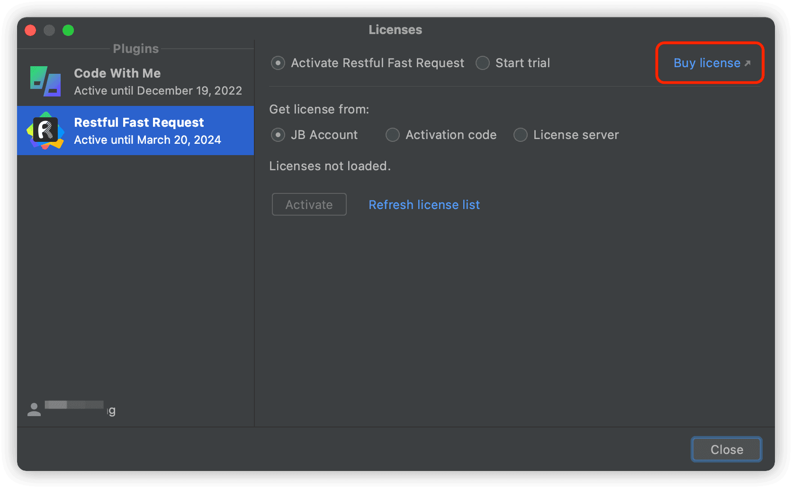

**Tow ways to buy**
* 1: Register jetbrains account to buy(Recommend)
* 2: Receive the license directly by email

**Registering a jetbrains account to purchase can facilitate the follow-up to find the license, and it is not easy to lose**

## Step0: Go to the plugin activation page
Click **help->Register Plugins...->Add New License**

## Step1: Click Buy license

## step2: Choose a package(Recommended annual subscription)

## Step3: Email confirmation(Email pattern)
If you have not registered a jetbrains account and logged in, you will enter this page, where you need to enter the email address that accepts the license
Click next to enter the purchase confirmation page

## Step4: Fill in the information and pay

## Step5: Fill in the license information to activate the plugin
Click **help->Register Plugins...->Add New License**

* Way 1: Log in to your jetbrains account
* Way 2: Enter the activation code in Activation code

**Please keep your activation code information properly**

**If you don't understand something, please join the slack and contact me**

