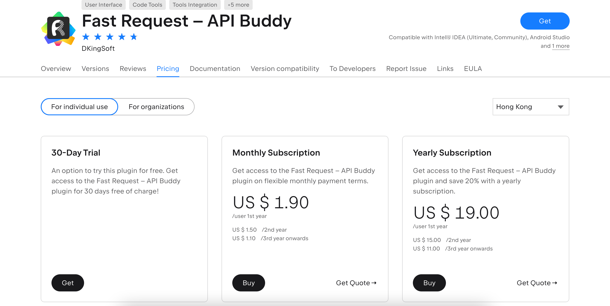
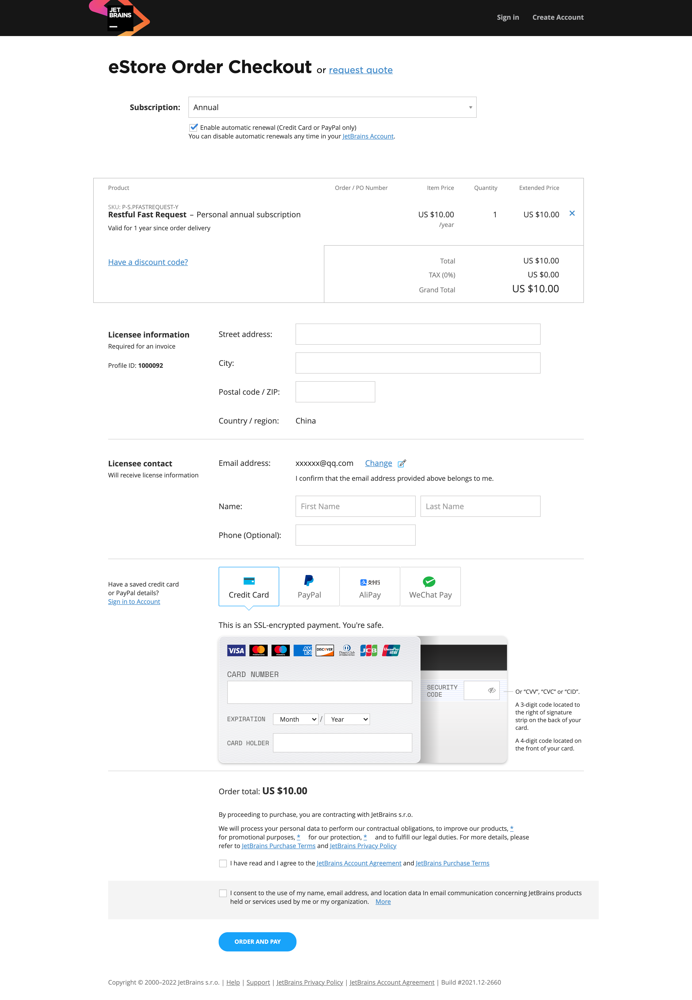

<Badge text="❤️Thanks for support original, support official edition❤️" type="tip" vertical="middle"/>

**Tow ways to buy**
* Account mode: Management via [JetBrains Account](https://account.jetbrains.com/licenses)(Recommend)
* Email mode: Receive the license directly by email
* License server mode: <Badge text="Not support" type="danger" vertical="middle"/>

**Registering a jetbrains account to purchase can facilitate the follow-up to find the license, and it is not easy to lose**

## Step0: Go to the plugin activation page

Click **Activate Plugin**
Of course, you can also try the plugin first，it's free 30 days.Please click start trial

## Step1: Click Buy license

## step2: Choose a package
* package 1: Monthly Subscription
* package 2: Yearly Subscription(Recommended)

## Step3: Email confirmation(Email mode)
If you have not registered a jetbrains account and logged in, you will enter this page, where you need to enter the email address that accepts the license.
Click next to enter the purchase confirmation page

## Step4: Type in the information and pay

## Step5: Type in the License information to activate the plugin
Click **help->Register Plugins...->Add New License**

* Way 1: Log in to your jetbrains account
* Way 2: Enter the activation code in Activation code

<a href="https://plugins.jetbrains.com/plugin/16988-restful-fast-request/pricing" style="font-size:30px;"><i class="icon iconfont icon-buy" style="font-size:30px"></i>Buy</a>

## Tips💡
:::danger License info

**Please keep your activation code information safe and do not leak the License information**

:::

**If you have some questions, please join the Telegram and contact me** on 