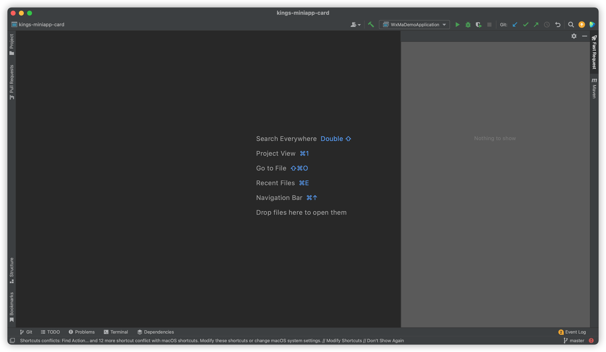

[[toc]]
 

## Why the plugin doesn't respond
Answer:Please configure the relevant configuration according to the steps introduced in the first chapter first, and then click the icon.  

## Idea freezes after clicking the fastRequest icon
Answer:The entity class you designed is nested and recursive, the plugin does not support.
``` java
public class A{
    private B b;
    private int xx;
}
public class B{
    private A a;
    private String xx;
}
```

If you don't need the B property in the above case, then you can manually add a static keywords to property B when generating

``` java
public class A{
    private static B b;
    private int xx;
}
```

## Regeneration function
Designed to reset generated parameters,it will clear the parameters of the previous API,but does not include the save action.  
If your API has been saved and you want to change the parameters again, then you can click the regenerate button and remember to save again, otherwise the original parameters will be retained.  
(It is equivalent to operating a file, emptying the content of the file but not saving it, then you will still see the original file before modification)

## Nothing to show<Badge text="2022.1.4+" type="danger"/>


step1:Click **help->Register...->Add New License**

* Way 1: Log in to your jetbrains account(Make sure you have buy the license)
* Way 2: Enter the activation code in Activation code
* Way 3: Click start trial


step2: restart idea


<Badge text="If it doesn't work in the way above, there may be a problem with your license" type="danger" vertical="middle"/>