[[toc]]

## Make icon move
Developers can freely choose and switch the color you want in the drop-down box, and can make it moving

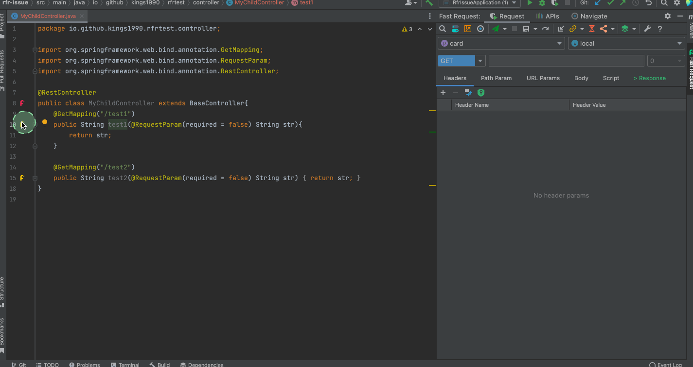

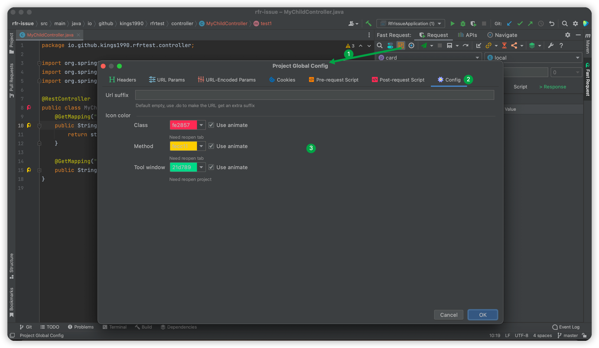

## Debug API & send request<Badge text="2.0.0"/>

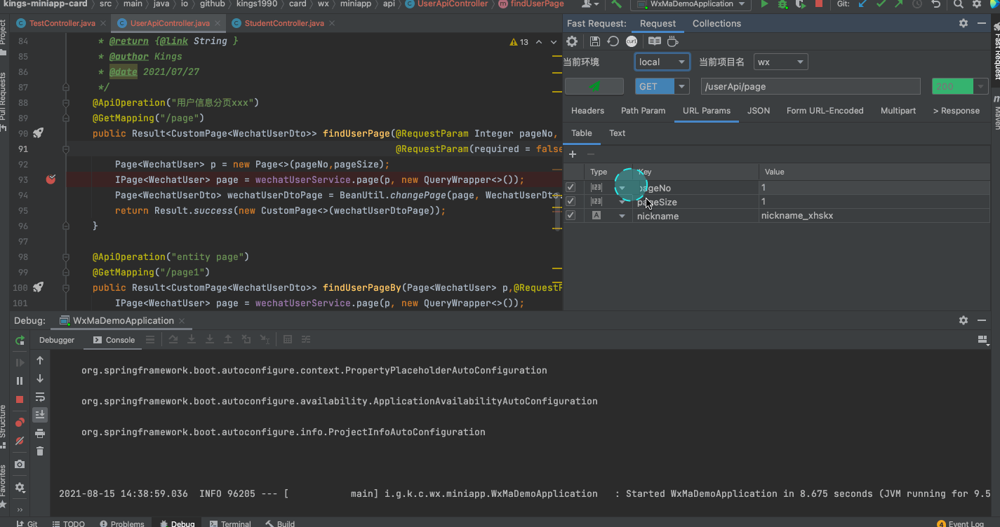

## SearchEveryWhere support<Badge text="2.1.1" />

```
example
/url              (search by url)
get /list         (search by get method and url)
post /save        (search by post method and url)
```


## Send and download<Badge text="2.0.2" type="error"/>

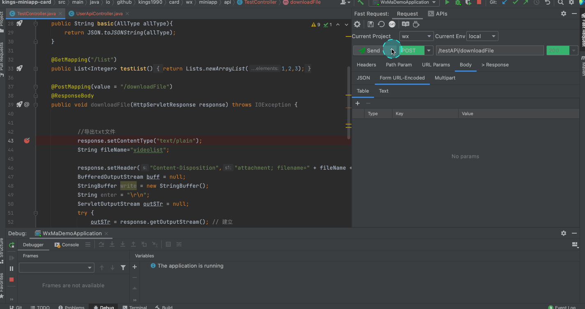

## Script
Scripts allow developers to more flexibly, dynamically and easily modify some input parameters of the request process and the processing of responses.
Please refer to [Script](./script.md)

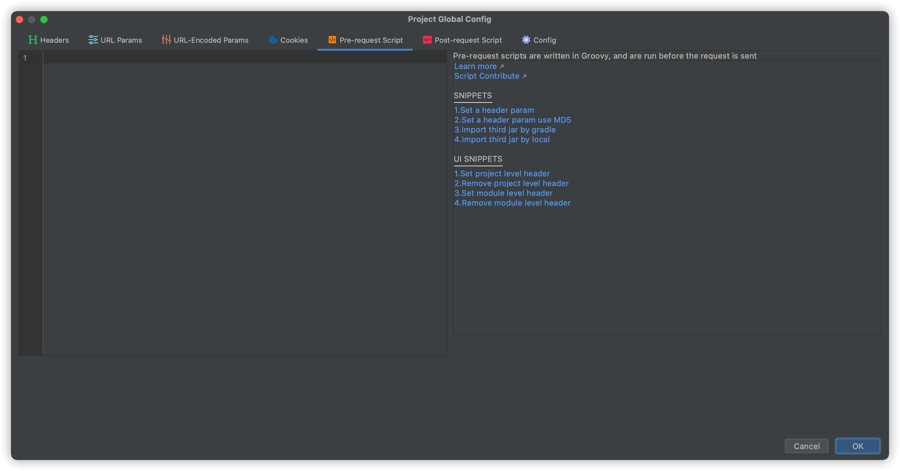

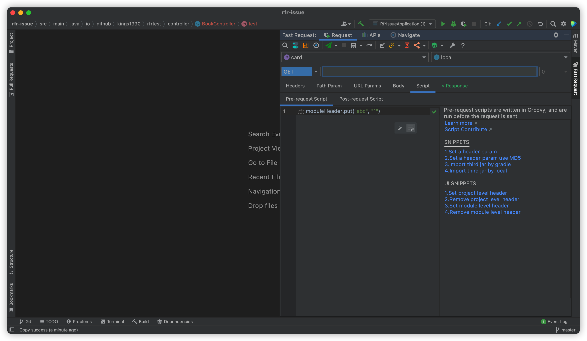

## APIs export to Postman<Badge text="2.1.2" type="error"/>


## API List<Badge text="2.0.1" type="warning"/>

::: tip API name value calculate:

1. If the method uses swagger annotation **@io.swagger.annotations.ApiOperation**,Then take the value of the annotation
2. If there is no swagger annotation,Then take the java Doc description of the method
3. If two above not matched, return **New Request**

API name value supports modification  
:::

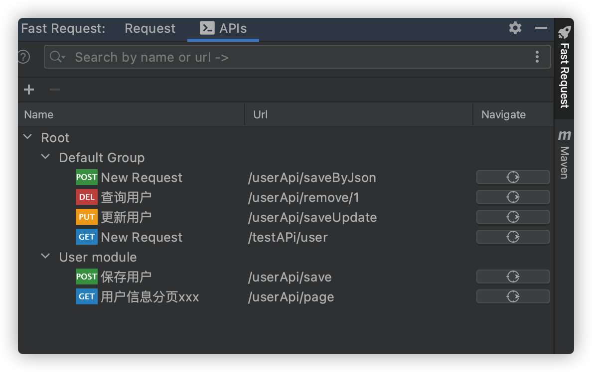
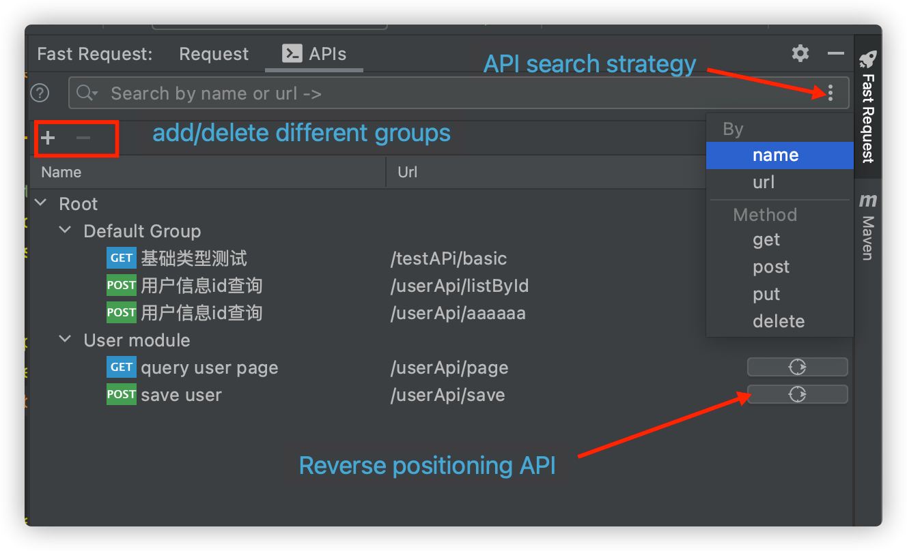

## Save Request<Badge text="2.0.0"/>

:::tip Special Note  
1.The saved request will be put in *Default Group* by default, support drag and drop into other groups,Of course, it is best to join the module group, please see `API group automatic association`

2.API Name:If the api uses swagger annotations `@ApiOperation("xxx")`,The api is named xxx,If there is no swagger annotation,Use javadoc as the name of the api,Otherwise it will be named New Request
```
if (@ApiOperation("xxx"))
    apiName = xxx
else if(java doc)
    apiName = java doc
else 
    apiName = New Request       
```
:::
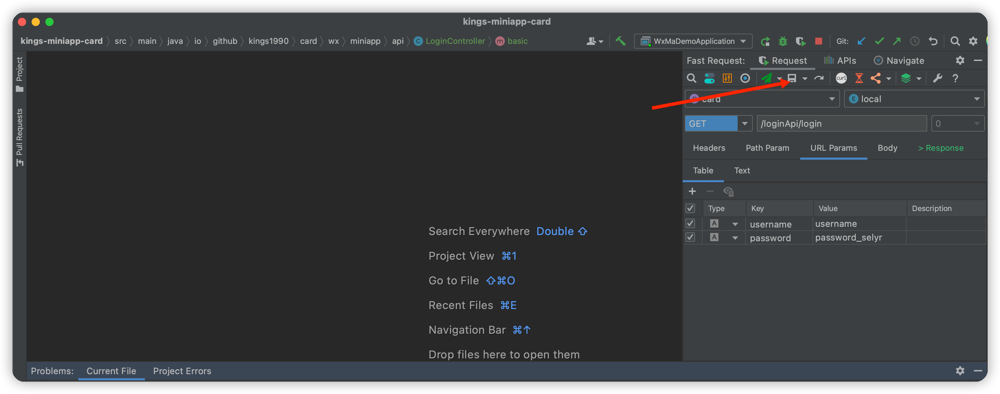

## API grouping parameter save support<Badge text="2022.2.1" type="error"/>
Purpose: Save parameters of different combinations under one API

==The original save operation will be classified into the Default group by default==

How to:After entering the parameters, click ==Save group param request==


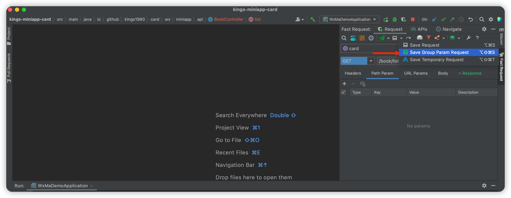

**Toggle parameter**

The following is the query of the book list in 3 languages


## Temporary request save support<Badge text="2022.2.1" type="error"/>

Purpose: Save any request that does not belong to this project for temporary invocation, not associated with the current project code

The Url of the Request saved by the temporary request must start with ==http== or ==https==


## Regenetate<Badge text="2.0.0" type="error"/>
:::tip Special Note  
If you have saved a request,But if you want to completely re-modify the parameters, then you can choose this operation  
:::

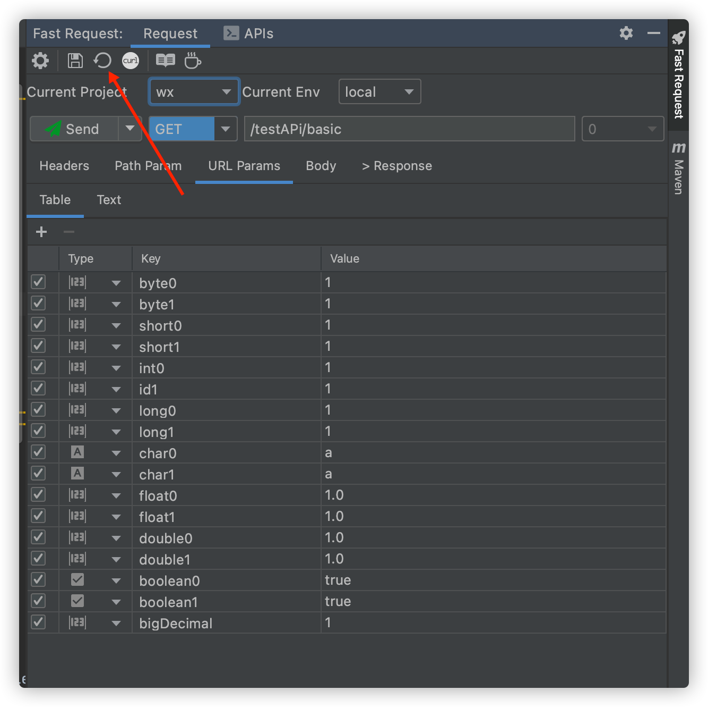

## CURL copy<Badge text="1.1.4" type="warning"/>
After generate the method url and parameters, click on the toolbar

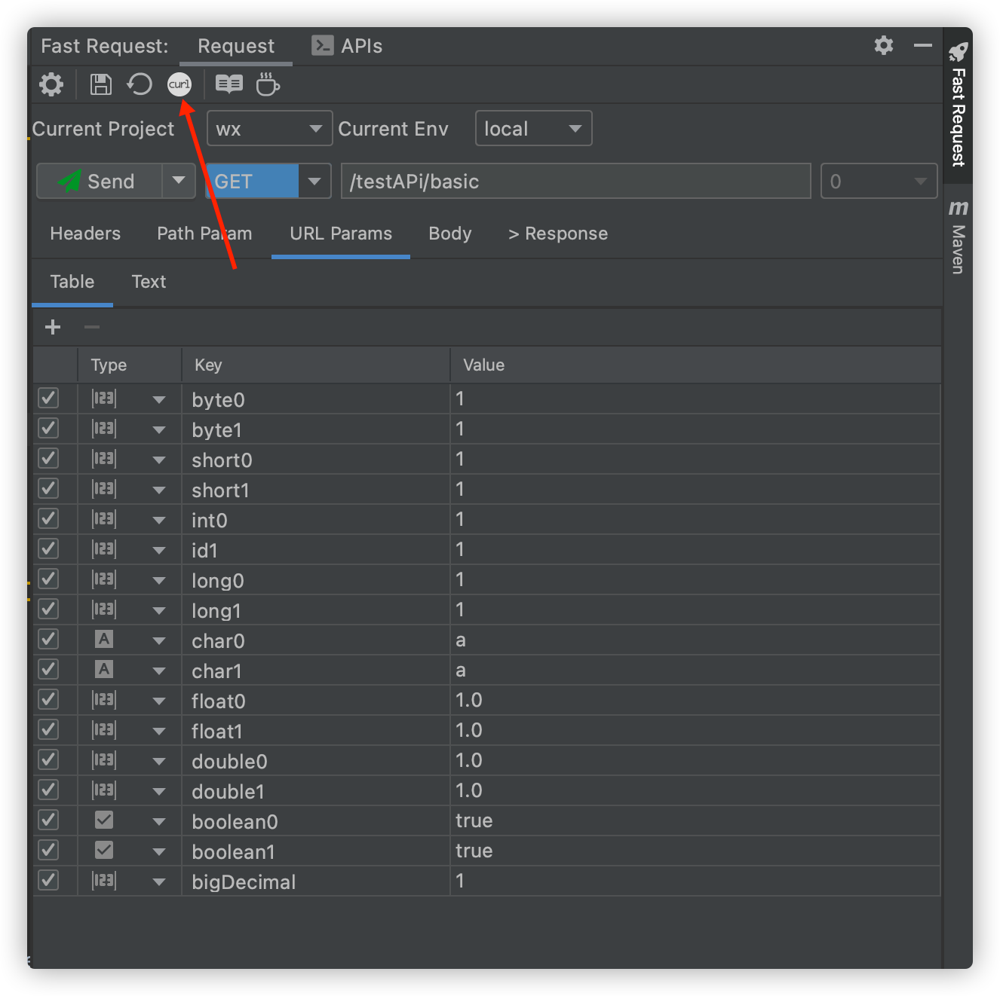


## Quickly add header<Badge text="2.0.0"/>
If your request requires a token and the token can be obtained through a login interface, then you don't need to manually add it each time, just visit the login interface and then process it through the following operations

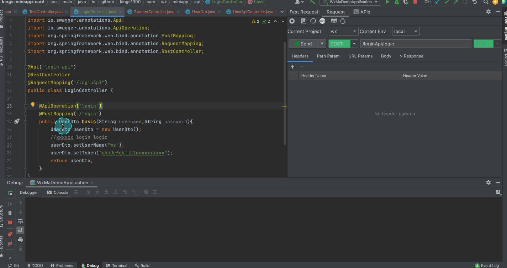

## API group automatic association<Badge text="2.0.6" type="warning"/>
The API group is to save the saved apis into different groups to distinguish different apis,When in a multi-module project,plugin support scan modules in projects,and quickly add the module name to the group, this way will add the group to the root group

**v2.1.2 will automatically create module group**

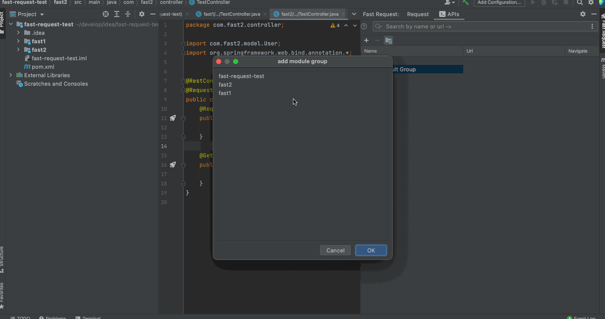

:::tip Special Note
1. If the module group is not created, then when saving the request, the saved request will be placed in the Default Group
2. If you create a module group, when you save the request, it will be automatically classified into the corresponding Module Group according to the module where the current API is located.
3. Of course, you can move the API to the corresponding smaller group by dragging  
:::

Module supports quick search(Put the cursor on the list and enter keywords)


## Json grammar check<Badge text="2.0.6" type="error"/>
The upper right corner of the json parameter input box provides a json syntax check. If the json is incorrect, the corresponding error will be prompted  
Of course it also supports formatting and other operations

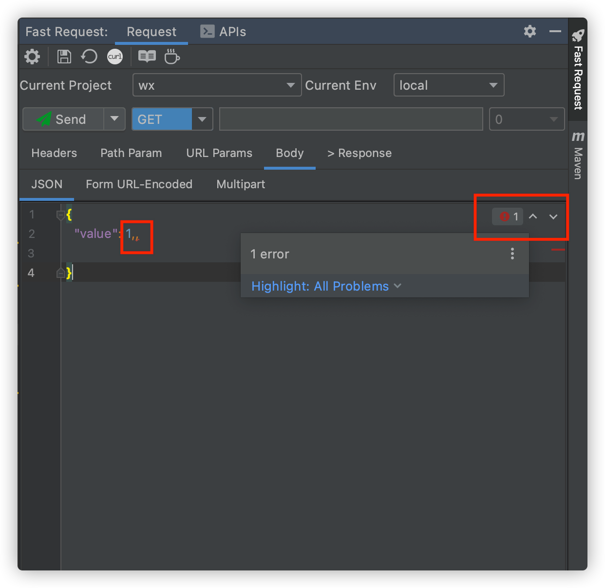

## API navigate tree<Badge text="2.0.7"/>
```
Select the tree and enter keywords
Press Enter again or double-click the left mouse button to locate the API

Hover the mouse to display the doc of the api

The API Navigate tree is lazy loaded by default, you need to click the refresh button, 
and every time you add an API, you also need to refresh to get it

Lazy loading helps to speed up idea startup
```


## Headers group(Automatic switching)<Badge text="2.0.7"/>
```
Scenes:Multi-module projects such as SpringBoot have different header parameters in different projects and different environments. In order to quickly switch headers, header grouping is introduced.  
Operation method：
1.Modify in the headers group, constraint: the input value must be in standard json format
2.Switch the environment or project name directly, and then enter the corresponding key and value values in the headers form
```


## APIs import and export<Badge text="2022.1.4" />
Using this function, you can easily share your existing APIs with other developers, or import to IDEA on other devices

::: danger Attention
* A new file named fastRequestCollection.xml will be added when exporting,You can't rename it, it is exported to the current project path by default.

* When importing, it will do a default backup,And will generate a file named fastRequestCollection-yyyyMMddHHmmssSSS.xml under the .idea folder ,
If it is imported by mistake, it can be restored by importing it

* Click file->Reload All from Disk to force refresh to get fastRequestCollection.xml if it is not visible
:::


## Swagger default value parsing support<Badge text="2022.1.4" />
Below are some examples

Priority: swagger default value > config default value
:::: code-group

::: code-group-item swagger2
```java
* @ApiParam

@GetMapping(value="/test/{id}")
public String test3(@ApiParam(name = "id",example="2") @PathVariable("id") Integer id) {
    return "";
}

@GetMapping(value="/test/{id}")
public String test3(@ApiParam(name = "id",defaultValue="2") @PathVariable("id") Integer id) {
    return "";
}


* @ApiImplicitParam

@ApiImplicitParams({
    @ApiImplicitParam(paramType="query",name="pageNo",dataType="String",required=true,value="pageNo",defaultValue="1"),
    @ApiImplicitParam(paramType="query",name="pageSize",dataType="String",required=true,value="pageSize",defaultValue="10")
})
@GetMapping(value="/testPage)
public String testPage(@RequestParam("pageNo") Integer pageNo, @RequestParam("pageSize") Integer pageSize) {
    return "";
}


* @ApiModelProperty
@Data
public class UserDto {
    @ApiModelProperty(example = "Bob")
    private String userName;
}
```
:::

::: code-group-item swagger3
```java
* @Parameter

@GetMapping(value="/test/{id}")
public String test3(@Parameter(name = "id",example="2") @PathVariable("id") Integer id) {
    return "";
}

* @Schema(swagger3)

@Data
public class UserDto {
    @Schema(example = "Bob")
    private String userName;
}
```
:::

::::


## Auto Description<Badge text="2022.1.5" />
Field description need to conform to standard javadoc. Please use`/**some description*/`

You can hide or show description by toggle click


## API share document<Badge text="2022.1.5+" />

Please note that the API in word form is implemented in html, so don't feel strange, just export it

Response Example requires running your API to be displayed

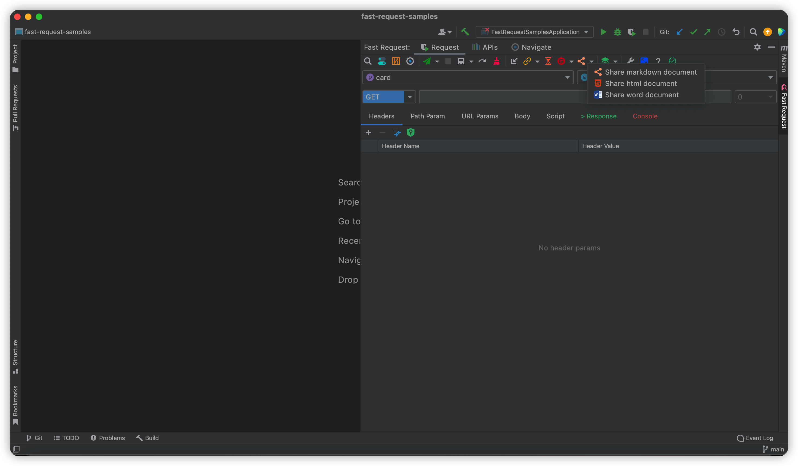


## API list preview<Badge text="2022.1.5" />

After focusing on the window, enter the keyword, and you can quickly search according to the path keyword of the API


## Project-level global parameters support<Badge text="2022.1.8" />
Support global parameters within the project level, not affected by multiple modules.

Configure priority `api header > project header>global header`


## cURL import<Badge text="2022.2.1" />
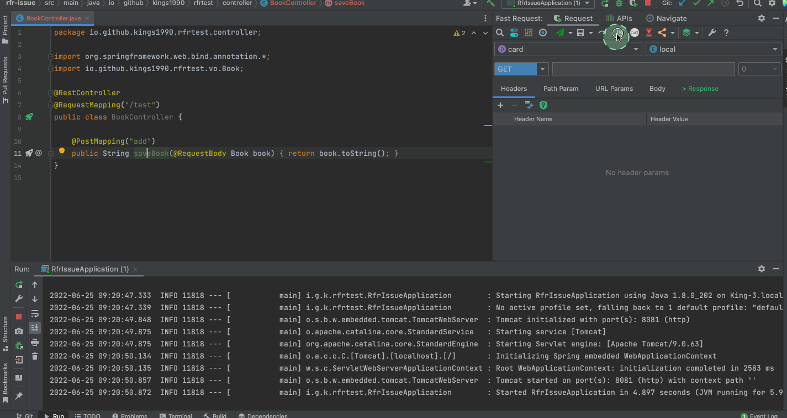
