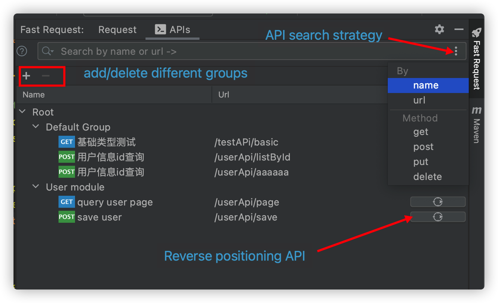
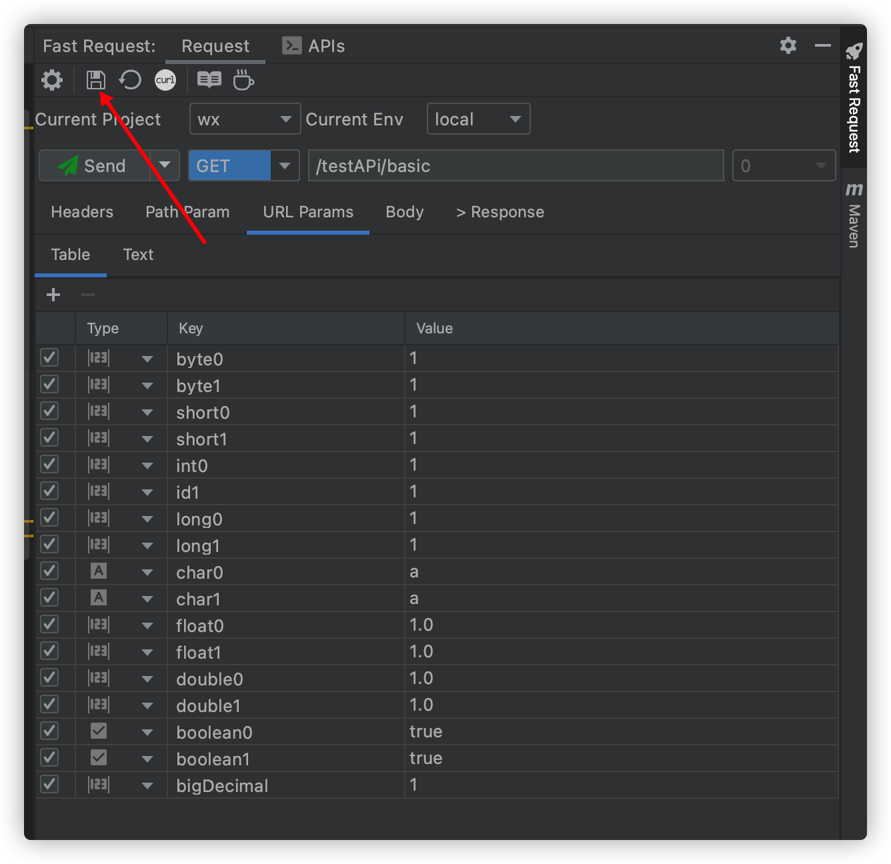
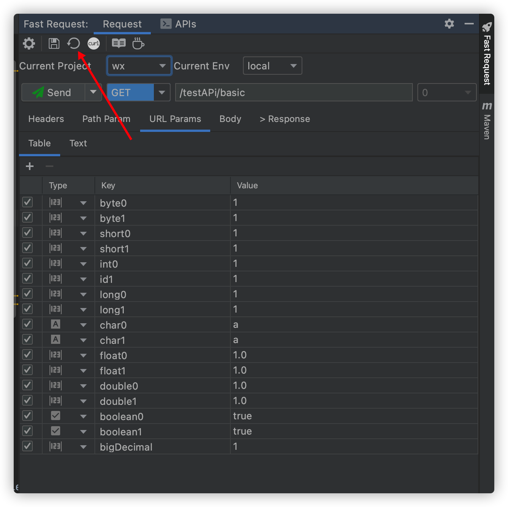
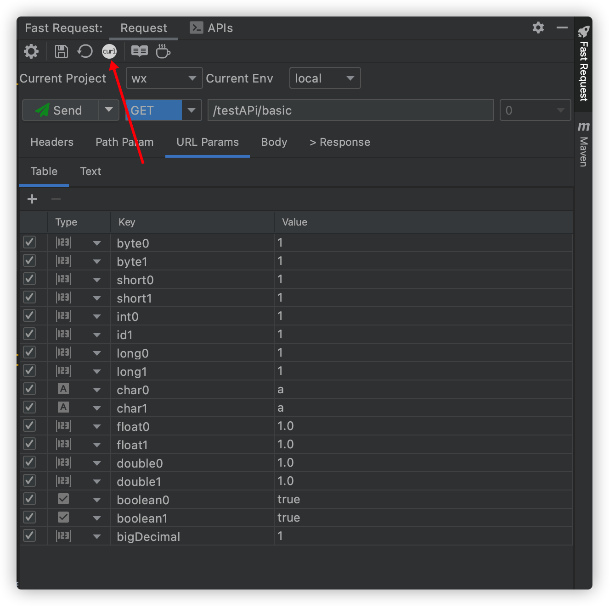
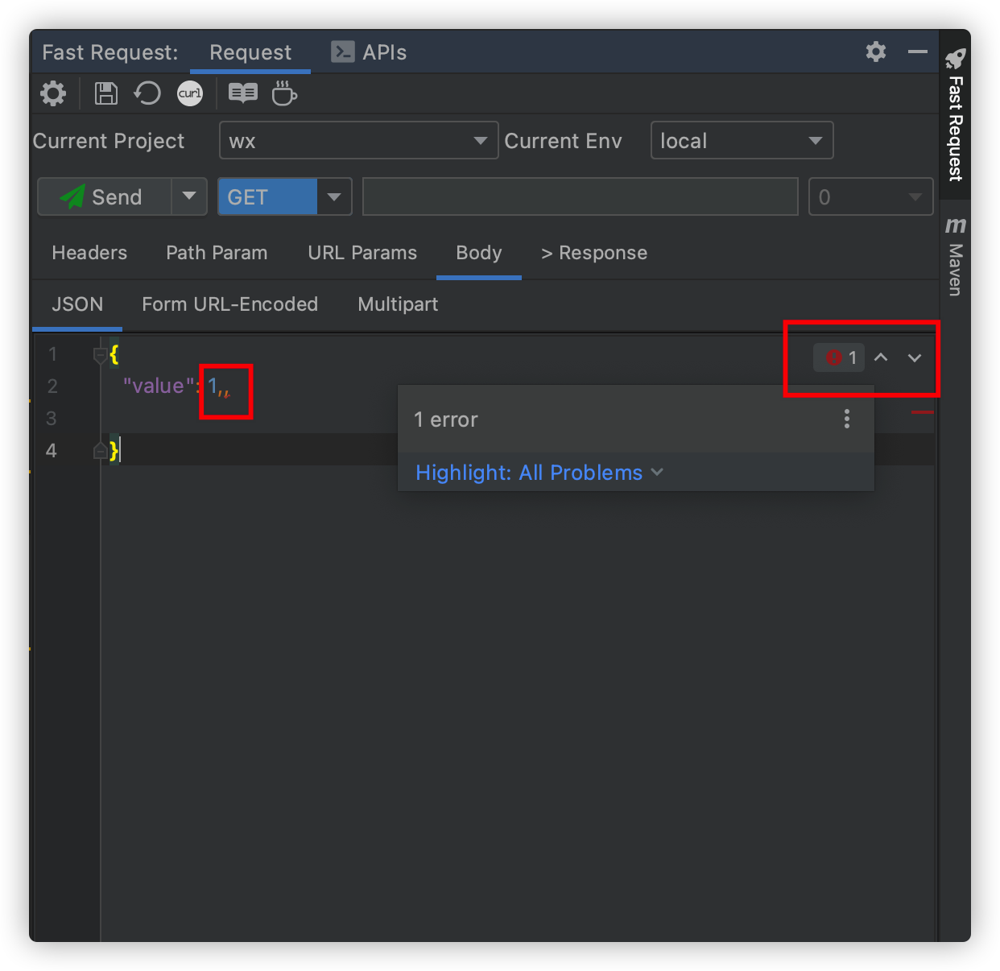

# Features

* Generate url and parameters in one click
* SearchEveryWhere support<Badge text="new" />
* APIs export to Postman<Badge text="new" />
* Send request to debug API(support to modify the generated parameters)
* Send request and download
* Domain customization and switching
* Custom parameter parse
* String generation strategy
* Save api
* Management API (search filter, modify API name)
* One click location history save api to method
* Api to curl
* Built-in Json parameter editor
* Automatically associate APIs to module groups
* API navigate tree
* Headers group

## Debug API & send request<Badge text="2.0.0"/>


## SearchEveryWhere support<Badge text="2.1.1" />

```
example
/url              (search by url)
get /list         (search by get method and url)
post /save        (search by post method and url)
```


## Send and download<Badge text="2.0.2" type="error"/>


## APIs export to Postman<Badge text="2.1.2" type="error"/>


## API List<Badge text="2.0.1" type="warning"/>

::: tip API name value calculate:

1. If the method uses swagger annotation **@io.swagger.annotations.ApiOperation**,Then take the value of the annotation
2. If there is no swagger annotation,Then take the java Doc description of the method
3. If two above not matched, return **New Request**

API name value supports modification  
:::




## Save Request<Badge text="2.0.0"/>

:::tip Special Note  
1.The saved request will be put in *Default Group* by default, support drag and drop into other groups,Of course, it is best to join the module group, please see `API group automatic association`

2.API Name:If the api uses swagger annotations `@ApiOperation("xxx")`,The api is named xxx,If there is no swagger annotation,Use javadoc as the name of the api,Otherwise it will be named New Request
```
if (@ApiOperation("xxx"))
    apiName = xxx
else if(java doc)
    apiName = java doc
else 
    apiName = New Request       
```
:::



## Regenetate<Badge text="2.0.0" type="error"/>
:::tip Special Note  
If you have saved a request,But if you want to completely re-modify the parameters, then you can choose this operation  
:::



## CURL copy<Badge text="1.1.4" type="warning"/>
After generate the method url and parameters, click on the toolbar




## Quickly add header<Badge text="2.0.0"/>
If your request requires a token and the token can be obtained through a login interface, then you don't need to manually add it each time, just visit the login interface and then process it through the following operations


## API group automatic association<Badge text="2.0.6" type="warning"/>
The API group is to save the saved apis into different groups to distinguish different apis,When in a multi-module project,plugin support scan modules in projects,and quickly add the module name to the group, this way will add the group to the root group

**v2.1.2 will automatically create module group**


:::tip Special Note
1. If the module group is not created, then when saving the request, the saved request will be placed in the Default Group
2. If you create a module group, when you save the request, it will be automatically classified into the corresponding Module Group according to the module where the current API is located.
3. Of course, you can move the API to the corresponding smaller group by dragging  
:::

Module supports quick search(Put the cursor on the list and enter keywords)


## Json grammar check<Badge text="2.0.6" type="error"/>
The upper right corner of the json parameter input box provides a json syntax check. If the json is incorrect, the corresponding error will be prompted  
Of course it also supports formatting and other operations



## API navigate tree<Badge text="2.0.7"/>
```
Select the tree and enter keywords
Press Enter again or double-click the left mouse button to locate the API

Hover the mouse to display the doc of the api
```


## Headers group(Automatic switching)<Badge text="2.0.7"/>
```
Scenes:Multi-module projects such as SpringBoot have different header parameters in different projects and different environments. In order to quickly switch headers, header grouping is introduced.  
Operation method：
1.Modify in the headers group, constraint: the input value must be in standard json format
2.Switch the environment or project name directly, and then enter the corresponding key and value values in the headers form
```

