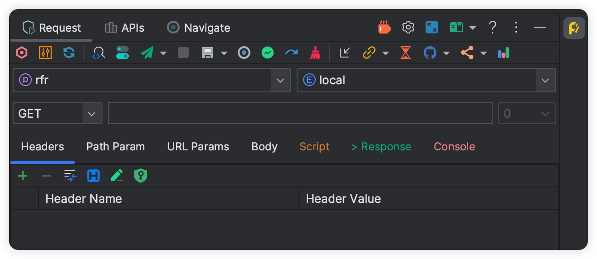

# Features

The icon in the document corresponds to the button icon in the plugin

## Request

- [<svg class="icon svg-icon" aria-hidden="true"><use xlink:href="#icon-restfulFastRequest"></use></svg> Make icon move](./makeIconMove.md)
- [<svg class="icon svg-icon" aria-hidden="true"><use xlink:href="#icon-search"></use></svg> SearchEveryWhere](./searchEveryWhere.md)
- [<svg class="icon svg-icon" aria-hidden="true"><use xlink:href="#icon-quanjucanshu"></use></svg> Project-level config](./projectValueConfig.md)
- [<svg class="icon svg-icon" aria-hidden="true"><use xlink:href="#icon-localScopeAction"></use></svg> Navigate to current method](./navigateCurrentMethod.md)
- [<svg class="icon svg-icon" aria-hidden="true"><use xlink:href="#icon-send"></use></svg> Debug API & send request](./debugApi.md)
- [<svg class="icon svg-icon" aria-hidden="true"><use xlink:href="#icon-sendDownload"></use></svg> Download file](./downloadApi.md)
- [<svg class="icon svg-icon" aria-hidden="true"><use xlink:href="#icon-stop"></use></svg> Stop API request](./stopRequest.md)
- [<svg class="icon svg-icon" aria-hidden="true"><use xlink:href="#icon-saveNew"></use></svg> Save request](./saveRequest.md)
- [<svg class="icon svg-icon" aria-hidden="true"><use xlink:href="#icon-saveGroup"></use></svg> <svg class="icon svg-icon" aria-hidden="true"><use xlink:href="#icon-apiParamGroup"></use></svg> API group](./apiGroup.md)
- [<svg class="icon svg-icon" aria-hidden="true"><use xlink:href="#icon-drafting"></use></svg> Temporary request](./tempRequest.md)
- [<svg class="icon svg-icon" aria-hidden="true"><use xlink:href="#icon-regenerate"></use></svg> Re generate](./regenerate.md)
- [<svg class="icon svg-icon" aria-hidden="true"><use xlink:href="#icon-clear"></use></svg> Clear](./clear.md)
- [<svg class="icon svg-icon" aria-hidden="true"><use xlink:href="#icon-import"></use></svg> cURL import](./curlImport.md)
- [<svg class="icon svg-icon" aria-hidden="true"><use xlink:href="#icon-curl1"></use></svg> cURL copy](./copyCurl.md)
- [<svg class="icon svg-icon" aria-hidden="true"><use xlink:href="#icon-urlCopy"></use></svg> Single url copy](./copyUrl.md)
- [<svg class="icon svg-icon" aria-hidden="true"><use xlink:href="#icon-history"></use></svg> History request](./historyRequest.md)
- [<svg class="icon svg-icon" aria-hidden="true"><use xlink:href="#icon-github"></use></svg> <svg class="icon svg-icon" aria-hidden="true"><use xlink:href="#icon-gitee"></use></svg> <svg class="icon svg-icon" aria-hidden="true"><use xlink:href="#icon-gitlab"></use></svg> API document sync](./apiDocSync.md)
- [<svg class="icon svg-icon" aria-hidden="true"><use xlink:href="#icon-shareDark"></use></svg> API document share](./shareApiDoc.md)
- [<svg class="icon svg-icon" aria-hidden="true"><use xlink:href="#icon-wendang"></use></svg> Document / Contact](./docAndContact.md)
- [<svg class="icon svg-icon" aria-hidden="true"><use xlink:href="#icon-tool"></use></svg> Setting manager](./settingManager.md)
- [<svg class="icon svg-icon" aria-hidden="true"><use xlink:href="#icon-fullScreen"></use></svg> Full screen](./fullScreen.md)
- [<svg class="icon svg-icon" aria-hidden="true"><use xlink:href="#icon-license"></use></svg> EULA](../eula.md)
- [<svg class="icon svg-icon" aria-hidden="true"><use xlink:href="#icon-chrome"></use></svg> Html preview](./htmlPreview.md)

## Apis

- [<svg class="icon svg-icon" aria-hidden="true"><use xlink:href="#icon-ppLib"></use></svg> API list](./apiList.md)
- [<svg class="icon svg-icon" aria-hidden="true"><use xlink:href="#icon-postman"></use></svg> APIs export to Postman](./apiToPostman.md)
- [<svg class="icon svg-icon" aria-hidden="true"><use xlink:href="#icon-export"></use></svg> APIs import and export](./apiImportExport.md)
- [<svg class="icon svg-icon" aria-hidden="true"><use xlink:href="#icon-shareDark"></use></svg> Batch export API doc](./batchExportApiDoc.md)

## Navigate

- [<svg class="icon svg-icon" aria-hidden="true"><use xlink:href="#icon-localScopeAction"></use></svg> API navigate tree](./apiNavigateTree.md)

## Generate

- [Swagger default value parsing support](./swaggerDefaultValueParse.md)
- [Auto Description](./autoDescription.md)

## Editor

- [<svg class="icon svg-icon" aria-hidden="true"><use xlink:href="#icon-restfulFastRequest"></use></svg> API list preview](./apiPreview.md)
- [Api comment preview](./apiCommentPreview.md)

## Script

- [<svg class="icon svg-icon" aria-hidden="true"><use xlink:href="#icon-script"></use></svg> Script](./script.md)

## Other

- [Quickly add header](./quickAddHeader.md)
- [Headers group](./headersGroup.md)
- [Json grammar check](./jsonGrammarCheck.md)
