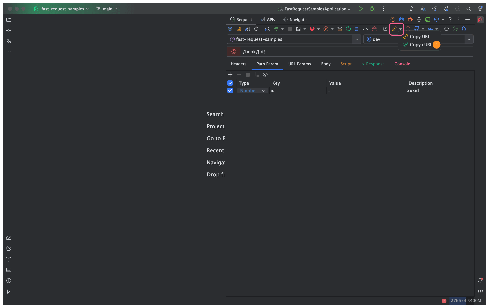

# cURL copy

Version required: <Badge text="1.1.4" />

After generate the method url and parameters, click on the toolbar <svg class="icon svg-icon" aria-hidden="true"><use xlink:href="#icon-curl"></use></svg> or <svg class="icon svg-icon" aria-hidden="true"><use xlink:href="#icon-curl1"></use></svg>

