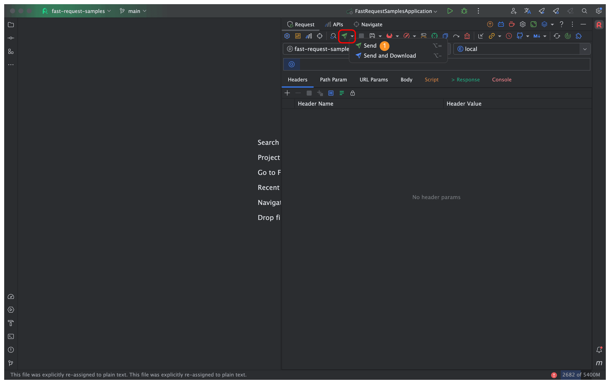

# Debug API & send request

In new version, send button have moved to toolbar and the left icon have been changed from <i class="icon iconfont icon-restfulFastRequest1"></i> to <i class="icon iconfont icon-restfulFastRequest"></i>

