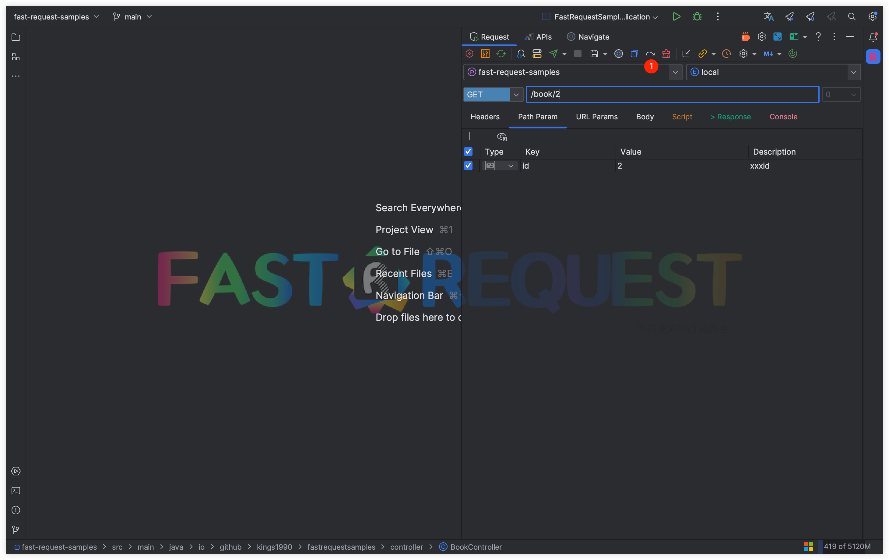

# Re generate

Version Required: <Badge text="2.0.0" type="error"/>

::: tip Special Note

If you have saved a request,But if you want to completely re-modify the parameters, then you can choose this operation

:::

