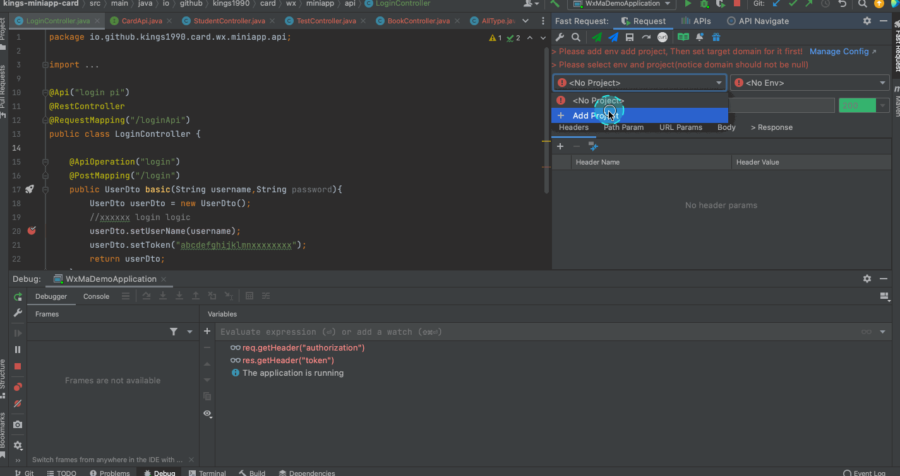
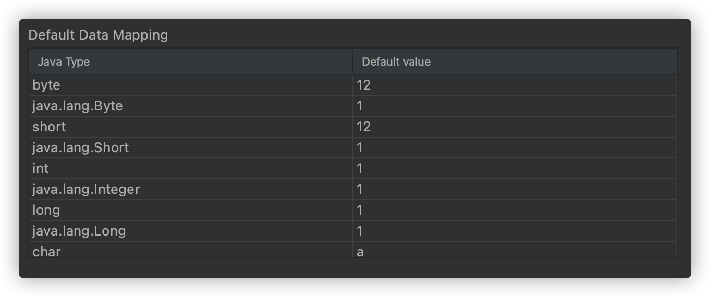

# Quick start
::: tip How to  
Step1:Click Manager config then add project name[example:wx card] and env[example:local、dev]  
Step2:set target domain  
Step3:open toolwindow(at the top-right corner),select project and env  
Step4:click fastRequest icon on method left(generate url and param)  
Step5:click send button for sending request  
:::



## Project/Env/Domain
Set up the mapping relationship,Configure the URL prefix address of the corresponding environment under the corresponding project


## String generation strategy
```
strategy
* name+random(field name + random string)
* random(random string)
* none(not generate)
```

::: tip example

:::

## Custom type mapping
Scenes:there are 10 attributes in`com.baomidou.mybatisplus.extension.plugins.pagination.Page`,but we just need size and current property

A total of 2 values need to be set for custom type mapping

**Java Type** is the corresponding object type,it must contain package name and class name
```java
com.baomidou.mybatisplus.extension.plugins.pagination.Page
```

**Default value** must be in json format
```json
{"size":10,"current":1}
```

::: tip example

:::

## Default type mapping
This configuration determines that the java basic type is parsed into the corresponding value，support modification
::: tip example

:::

## Other config
controller url fixed variable can replace by config, For example controller like this

```java
@RequestMapping("/api/${api-module}/user")
@Controller
public class XxxController(){
  //code ...
}
```

the actual url is `/api/base/user`,Then `${api-module}` can be replaced by the following configuration


## Icon and type mapping

|Icon|Type|
| --- | --- | 
|  |Array  |
| |Object |
| |Number |
| |String |
||Boolean|
||File|