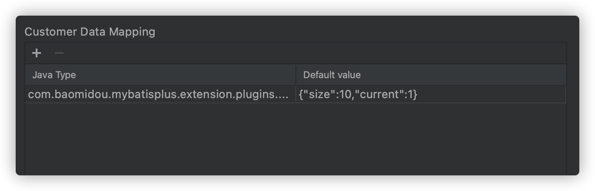
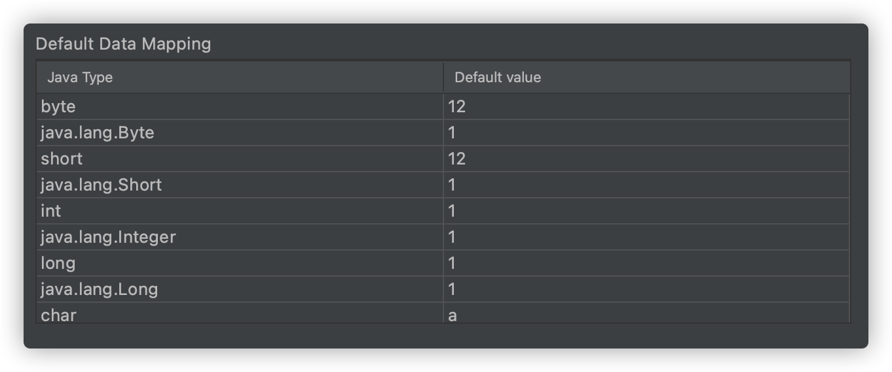
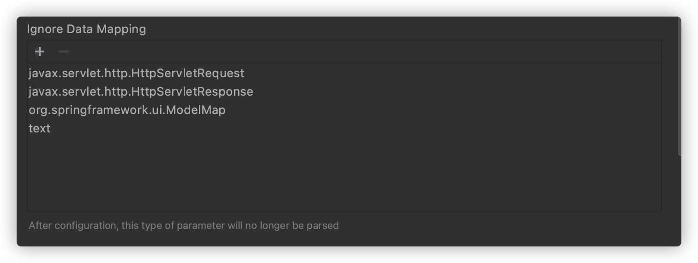

## Custom type mapping
Scenes:there are 10 attributes in`com.baomidou.mybatisplus.extension.plugins.pagination.Page`,but we just need size and current property

A total of 2 values need to be set for custom type mapping

**Java Type** is the corresponding object type,it must contain package name and class name
```java
com.baomidou.mybatisplus.extension.plugins.pagination.Page
```

**Default value** must be in json format
```json
{"size":10,"current":1}
```



## Default type mapping
This configuration determines that the java basic type is parsed into the corresponding value，support modification



## Ignore data mapping
This configuration determines whether the class will be parsed, it need full class name path(packageName+className)

