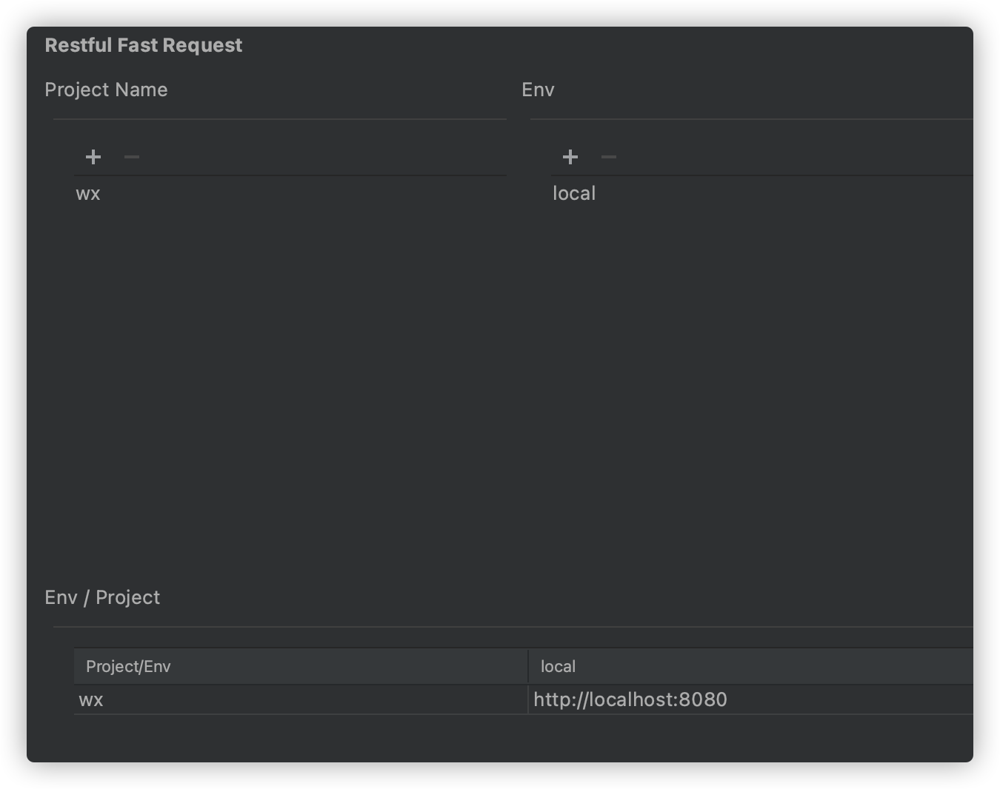

Set up the mapping relationship,Configure the URL prefix address of the corresponding environment under the corresponding project



```
The icon P means Project, and the icon E means Environment
```


