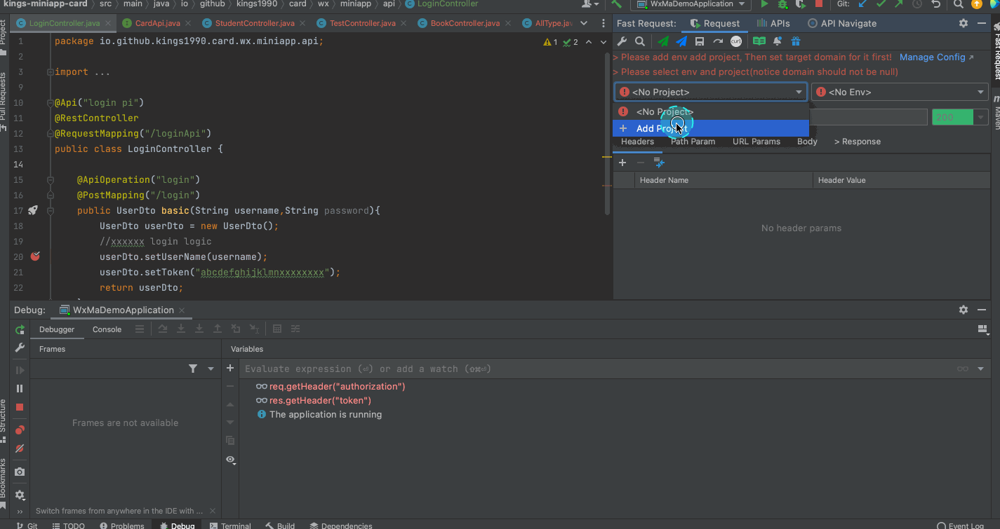

::: tip How to  
* Step1: Click Manager config then add project name[example:wx card] and env[example:local、dev]  
* Step2: set target domain  
* Step3: open toolwindow(at the top-right corner),select project and env  
* Step4: click fastRequest icon on method left(generate url and param)  
* Step5: click send button for sending request  
:::

