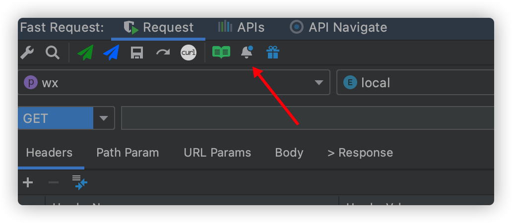
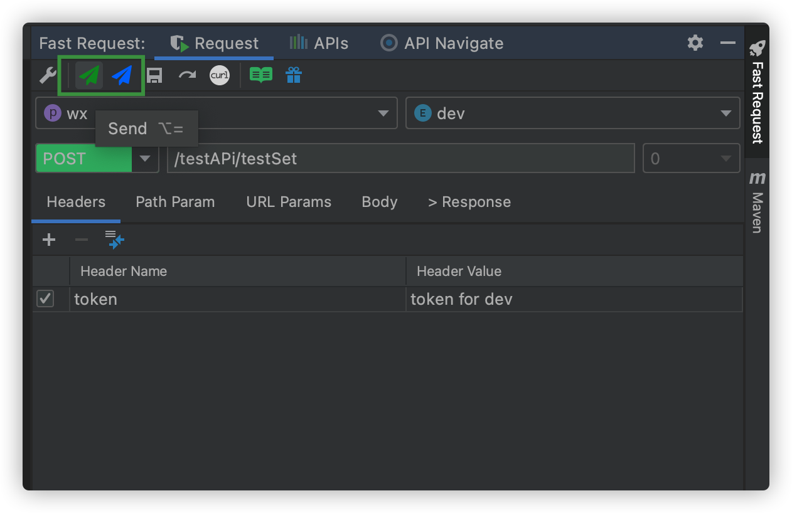
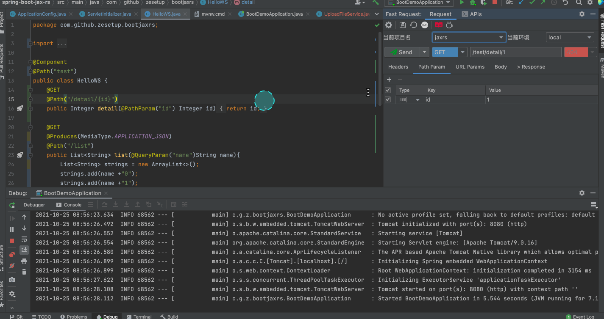
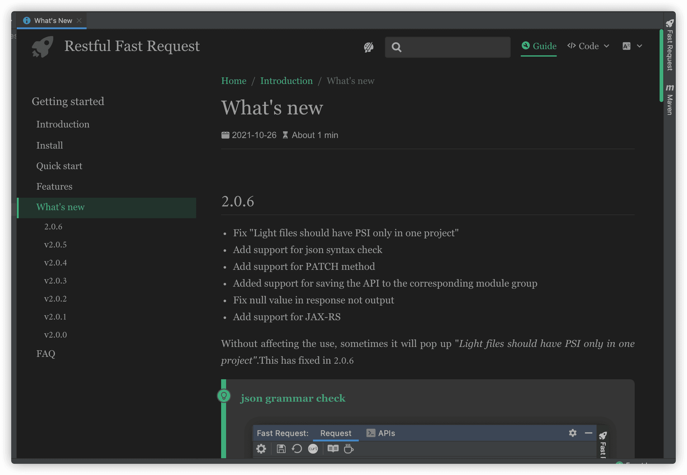

## 2022.1.4 <Badge text="收费" type="warn"/>
* SearchEveryWhere highlight optimization
* Add support for import and export APIs
* Add support for run APIs
* Add timeout for api request
* Merged Send and Send and Download buttons
* APIs user interface optimization
* API Navigate rename to Navigate in tab
* Optimize the user guide of features
* Compatible with idea 2022.1
* Make it optional for automatically generate parameters

## v2.1.3
* Add encode support for special symbol in parameter
* Add global headers to curl

## v2.1.2

* Add support for export api to Postman
* Open the idea lazy loading API Navigate tree for the first time
* SearchEveryWhere show module
* Optimize URL parsing
* Optimize the display of api navigate tree
* Optimize the group when save api
* Global header params support


:::tip Optimize URL parsing

```
support parse like following example
no longer need to configure the URL Replace Config separately

Scene 1: URLS are class constant references
@RequestMapping(Url1.URL_TEST)
@RestController
public class UrlTestController {
    private static final String URL= "xxx";

    @GetMapping(value = URL)
    public Integer testUrl(){
        return 1;
    }
}

Scene 2: value is an array
@RequestMapping(
    value = {"/v1/save"},
    method = {RequestMethod.POST}
)
```
:::

:::tip Add support for export api to Postman


:::

:::tip SearchEveryWhere show module


:::

:::tip Optimize the group when save api

```
when saving the api,it will save to a group named controller's name

```


:::

:::tip Global header params support


:::

## v2.1.1

* SearchEveryWhere support
* Add a what's new button to view the latest version at any time
* Optimize the parsing of enum
* Add support for http redirect

:::tip SearchEveryWhere support

```
example
/url  
get /list         (used for search get method)
post /save        (used for search post method)
```


:::

:::tip Quick view of the latest version

:::

## v2.1.0.2

* Joined the organization [**Dromara**](https://dromara.org/zh/)(An organization dedicated to native solutions for the
  microservice cloud)

## v2.1.0.1

* Fix get param error

## v2.1.0

* Fix post api parse error when using @RequestBody and @RequestParam
* Parsing support for nested classes
* Add support for url parse from the path property of the @RequestMapping in controller class level
* Added support for Api Tree scanning with @RequestMapping class

## v2.0.9

* Fix "Slow operations are prohibited on EDT" for 2021.3+
* Fix add headers from response
* Add project-level configuration,env and project will not change while switch project
* Add format action icon to textEditor

:::tip Add headers from response

```
if your api need token in header,you can do like this to add params to header from response
```


:::

:::tip Add format action icon to textEditor

:::

## v2.0.8.1

* Fix conflicting error when searchEveryWhere
* Adjust position of toolbar action button
* remove unnecessary dependence,size 11.1M->5.9M

## v2.0.8

* Fix npe when first add project/env
* Json tree response character rendering maximum limit
* Add support for filter by methodType in Api navigate
* Add support for ignoring parameter parsing
* Fix some EDT problem
* Send/sendDownload button support for custom shortcut keys
* Fix response text not show in 2021.3

:::tip send/sendDownload button support for custom shortcut keys

```
shortcut is available anywhere to trigger the event,No longer need to focus on the tool window
```


:::

:::tip Add support for filter by methodType in Api navigate

:::

## v2.0.7

* Add support for api navigate tree
* Add support for automatic switching of Headers with project and environment switching
* Optimized Windows system. In some cases, downloading files cannot pop up the directory
* Optimize the parameter parse of @RequestParam
* Optimize tool window project and env drop-down components and layout
* Optimize the prompt message of curl copy
* Optimize the prompt message of curl regenerate
* Add confirm operation when delete project and env config
* Fix the order of json field output is disrupted
* Move send button to toolbar and support keyboard shortcut

:::tip API navigate tree
```
Select the tree and enter keywords
Press Enter again or double-click the left mouse button to locate the API

Hover the mouse to display the doc of the api
```


:::

:::tip Headers Automatic switching
```
Scenes:Multi-module projects such as SpringBoot have different header parameters in different projects and different environments. 
In order to quickly switch headers, header grouping is coming.  
Operation method：
1.Modify in the headers group, constraint: the input value must be in standard json format
2.Switch the environment or project name directly, and then enter the corresponding key and value values in the headers form
```


:::

:::tip Optimize the parameter parse of @RequestParam
@RequestParam parameters will be prioritized according to the alias  
`@RequestParam("nameAlias")List<String> nameList` param name will be nameAlias
:::


:::tip Move send button to toolbar and support keyboard shortcut
```
send request: alt =
send and download: alt -  
Prerequisites:Tool window needs to be focused
```


:::

:::tip Optimize tool window project and env drop-down box and layout
```
Icon p represents project
Icon e represents environment  
```


:::


## v2.0.6
* Fix "Light files should have PSI only in one project"
* Add support for json syntax check
* Add support for PATCH method
* Added support for saving the API to the corresponding module group
* Fix null value in response not output
* Add support for JAX-RS
* Display what's new

Without affecting the use, sometimes it will pop up "*Light files should have PSI only in one project"*.This has fixed in 2.0.6

::: tip json grammar check

:::

::: tip API group automatic association


Module supports quick search

:::

::: tip JAX-RS support

:::

::: tip Show what's new  
Will only be shown once

:::

## v2.0.5

* JSON built-in editor support
* Fix checkbox hidden when change param by text
* Fix headers param show error when reshow the api
* Optimized the request progress bar display

## v2.0.4

* Fix the interface confusion caused by the response content aisle
* Optimization of response JSON ultra long display
* Optimized icon size
* Migrate Chinese documents to Gitee

## v2.0.3

*   Add confirmation when deleting api
*   Added the support of selecting all parameters and inverting selection
*   Fix param parse for java.util.Set
*   Fix parse like 【@RequestParam
*   Fix the confusion of the quick add header interface

## v2.0.2

*   Fix that the A request is displayed to the B project in the case of multiple open projects
*   Fix array and list param parse error decorate by @ResponseBody
*   Fix List without generic parse error
*   Add support for send and download
*   Show progressbar while sending request
*   Brand new document\[click the doc icon in the toolbar\]
*   Some optimization

## v2.0.1

*   rename from Fast Request to Restful Fast Request
*   merge Json、Form URL-Encoded、Multipart to Body Tab to reduce the tool window width
*   fix bug when modify config in global mode
*   add get、post、delete、put icon to saved request
*   saved request support more search strategy
*   rename tab name from collection to APIs
*   support parse java.time.YearMonth

## v2.0.0

*   support store request
*   support params optional
*   optimal iu
*   fix some bugs