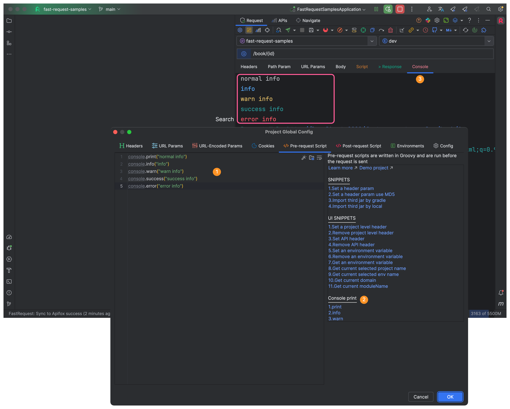

**Function**: Developers can use Groovy scripts to customize some logic, which makes the API more flexible, such as dynamically encrypting and signing parameters and putting them in the header rather than directly write dead

**Language**: [Groovy](https://groovy-lang.org/)       

Groovy syntax is almost identical to Java

## Script flow chart
```flow
st=>start: Start
op1=>inputoutput: Pre-request script
op2=>subroutine: Do request
op3=>operation: Post-request script
e=>end: End
st(bottom)->op1(right)->op2(right)->op3->e
```

## Test Project
[https://github.com/kings1990/fast-request-samples](https://github.com/kings1990/fast-request-samples)

## Case

* [x] Put md5 sign to header
```groovy
import cn.hutool.core.util.CharsetUtil
import cn.hutool.core.util.StrUtil
import cn.hutool.crypto.digest.DigestUtil

String body = StrUtil.str(request.bodyBytes(), CharsetUtil.CHARSET_UTF_8)
body = "xxx"//just for test
String sign = DigestUtil.md5Hex(body)
request.header("sign",sign)
```

## Built-in variable
::: danger Notice
Developers should pay attention to the fact that the built-in variable has been declared in the script edited by themselves, instead of creating a new Request or Response object, otherwise it may cause unexpected errors.
:::


Plugin use [hutool](https://hutool.cn/)的```cn.hutool.http.HttpRequest``` send request


### request <Badge text="2022.2.3️" type="tip"/>
* Remark: Contains request-related information, such as url, header, body, parameters
* Type: cn.hutool.http.HttpRequest

Parameters can be dynamically adjusted by modifying the request value

### response <Badge text="2022.2.3️" type="tip"/>
* Remark: Contains response information
* Type: cn.hutool.http.HttpResponse

You can get the result of the response through the response value

### rfr <Badge text="2022.2.3️" type="tip"/>
* Remark: Contains some properties related to plugin interaction


#### rfr.projectHeader <Badge text="2022.2.3️" type="tip"/>
```
Remark:Contains project-level headers, which can be modified to dynamically set values in the UI
Type:java.util.LinkedHashMap
```

#### rfr.moduleHeader <Badge text="2022.2.3️" type="tip"/>
```
Remark:Contains module level headers, which can be modified to dynamically set values in the UI
Type:java.util.LinkedHashMap
```


## Import third jar

::: tip Built-in Jar

```
com.alibaba:fastjson:1.2.78
cn.hutool:hutool-all:5.8.4.M1
com.google.guava:guava:30.1.1-jre
```
The version of Jar will be updated from time to time. If you find a bug, please contact up to upgrade

Developers can use the tools and methods provided by the above three Jars to reference directly in the script, without relying on third-party Jar
:::

* [x] Import jar(maven style)

Downloading the jar may take extra time

```groovy
@Grab("org.apache.commons:commons-lang3:3.12.0")
import org.apache.commons.lang3.StringUtils

String debug = request.header("debug")
if(StringUtils.isNotBlank(debug)){
    //some logic
}
```

* [x] Import jar(by local jar)

```groovy
//Note the file: prefix here
this.class.classLoader.addURL(new URL("file:/path/to/jar"))
def StringUtils = Class.forName("org.apache.commons.lang3.StringUtils").getDeclaredConstructor().newInstance()

String debug = request.header("debug")//get header
if(StringUtils.isNotBlank(debug)){
    //some logic
}
```

## Console <Badge text="2022.2.5" type="tip"/>
Console helps developers print some info you wanted

``` java
console.info("info")
console.print("print info")
console.warn("warn")
console.success("success")
console.error("error")

```



## Demo
::: tip 1.Sign parameter
Create a new xxx.groovy file in your local idea, paste the following code, after appropriate modification, it can ensure that the local can run normally, and then paste the code into the script

* <Badge text="Note that the final script needs to remove this line of code" type="danger"/>

~~HttpRequest request = HttpUtil.createPost("http://localhost:8081/book/add")~~

```groovy
import cn.hutool.core.util.CharsetUtil
import cn.hutool.core.util.StrUtil
import cn.hutool.crypto.digest.DigestUtil
import cn.hutool.http.HttpRequest
import cn.hutool.http.HttpUtil

//Note, note, note, this line of code needs to be deleted in the script
HttpRequest request = HttpUtil.createPost("http://localhost:8081/book/add")
        
//Script logic begins
String body = StrUtil.str(request.bodyBytes(), CharsetUtil.CHARSET_UTF_8)
body = "xxxx"//just for test
String sign = DigestUtil.md5Hex(body)
request.header("sign",sign)
```
:::

::: tip 2.Use the response of a request as the Header parameter of the request

```groovy
import cn.hutool.core.util.CharsetUtil
import cn.hutool.core.util.StrUtil
import cn.hutool.crypto.digest.DigestUtil
import cn.hutool.http.HttpRequest
import cn.hutool.http.HttpResponse
import cn.hutool.http.HttpUtil
import com.alibaba.fastjson.JSON

HttpRequest myRequest = HttpUtil.createPost("http://localhost:8081/api/v1.0/login")
HttpResponse myResponse = myRequest.execute()
if(myResponse.isOk()){
    String token = JSON.parseObject(myResponse.body()).getString("token")
    request.header("token",token)
}
```
:::

## Note
* Groovy scripts are not sensitive to ==;==, Java uses ; as the end of the statement code, Groovy uses a newline to indicate the end of a code
* The built-in variable has been declared. For example, in Demo 2, if an additional request needs to be created, the variable name needs to be noted that it cannot be the same as the built-in variable.

## Script contribute :star2:
In order to make the script more powerful, community script are welcome, develop can donate the script in comments, develop can ==vote== the script if you think the script help much,
High-voted and practical scripts will have the opportunity to join to ==Plugin page==,so that your homepage gets more attention :fire:

* 格式

```groovy
/**
 * Author:Kings
 * Main Page:https://github.com/kings1990
 * Function:xxxxx
 */

//Script begin
....
```

