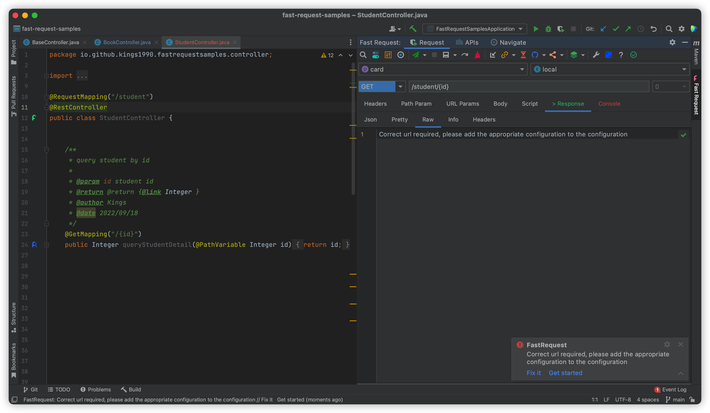

[[toc]]

## Url error

<Badge text="Solution" type="tip" />

1. Configure the correct domain name and enable the 2 drop down boxes for project and environment
2. Set the correct url, for example to replace the variable {id} on the url, you can replace the variable in the Path Param tab

## Multi-file upload
Enter multiple values and set the field type to file

## Pass text/plain param in body 
Please add **Content-Type: text/plain** in the header

Consider using add header by [`Common header`](./features/commonHeader.md)

## No controller, how to send a request
Refer to [Temporary request](./features/tempRequest.md)