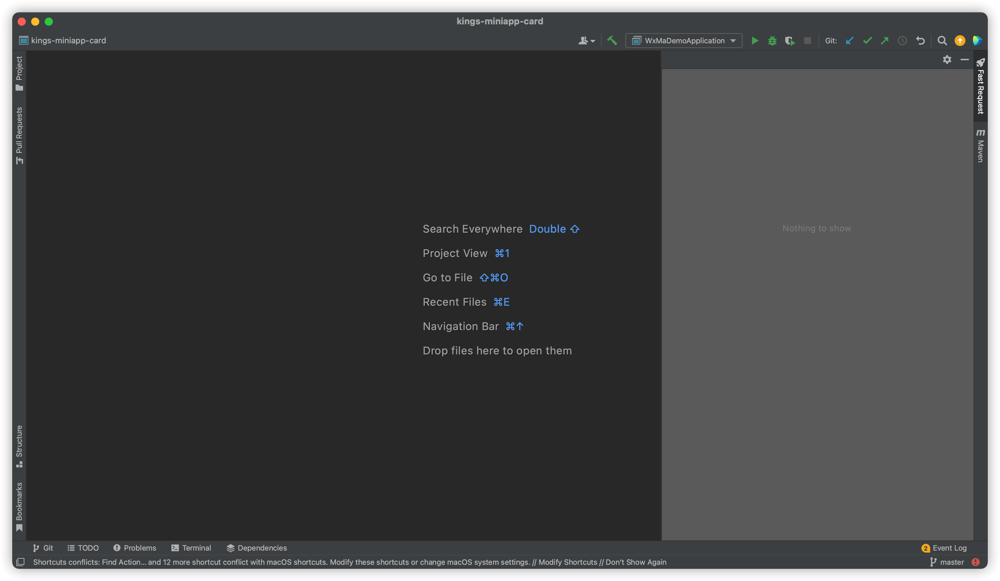
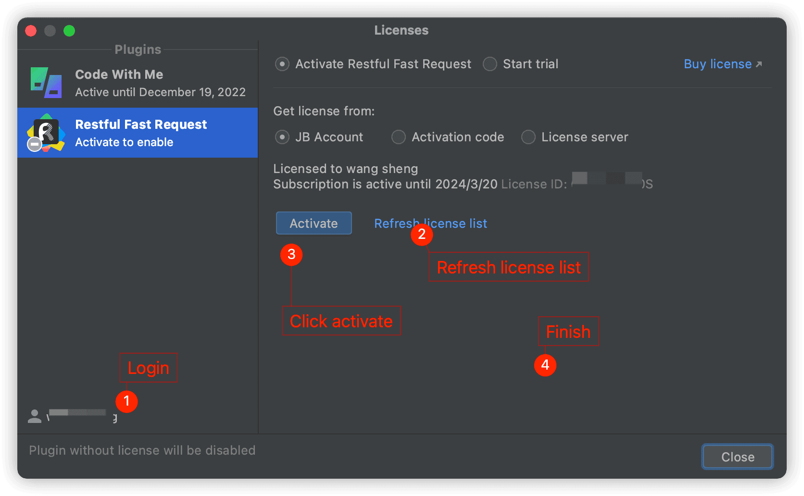

[[toc]]

## Q: 输入参数后调用 API 发现无效

**A:** 插件版本小于==2022.2.3==的在 table 控件编辑某个值的时候,需要在编辑完值后==先在空白处点一下==,再发送请求,该问题再 2022.2.3+版本得到修复

## Q: 为啥插件没反应

**A:** 请优先按照第一章节介绍的使用步骤配置相关的配置,再点击图标

## Q: 点击图标后 idea 卡死

**A:** 你设计的实体类嵌套递归,插件不支持,比如说 A 实体类有 B 实体类的属性,B 实体类有 A 实体类的属性

```java
public class A{
    private B b;
    private int xx;
}
public class B{
    private A a;
    private String xx;
}
```

以上这种情况如果你不需要 B 属性,那么你可以在生成的时候手动给 B 加一个 static 属性

```java
public class A{
    private static B b;
    private int xx;
}
```

## Q: 保存 API 图标旁重新生成的作用

**A:** 旨在重置生成的参数,会清空之前 API 的参数,但是不包含保存动作.  
如果你的 API 已保存,想重新换一下参数,那么你可以通过点击重新生成按钮,记得一定要再次保存,否则还是会保留原有的参数.

相当于你操作一个文件,清空文件内容但未保存,那么看到的将还是原来修改前的文件

## Q: Nothing to show <Badge text="2022.1.4.0+" type="danger"/>



<Badge text="请按照以下步骤注册license" type="danger" vertical="middle"/>

如果点击<i class="icon iconfont icon-restfulFastRequest"></i>报 npe 或者界面不显示的情况,用以下方式解决

step1: 点击 **help->Register...->Add New License**
如果有老的 License 或者有问题的 License,请先点击 Remove License

- 方式 1: 登录 jetbrains 账号(拥有激活的 license)
- 方式 2: 在 Activation code 中输入正确且有效的激活码
- 方式 3: 点击开始试用(start trial)



step2:重启 idea

## Q:遇到 Fix Light files should have PSI only in one project

**A:** 此问题发生在版本低于 2022.1.4.0,如果遇到请去 github 下载修复版[https://github.com/dromara/fast-request/issues/61](https://github.com/dromara/fast-request/issues/61)
