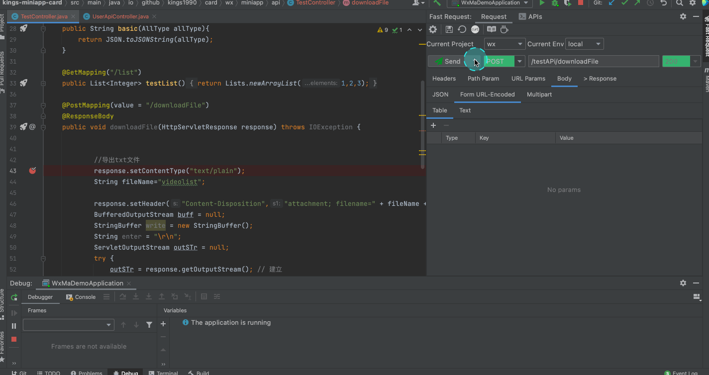
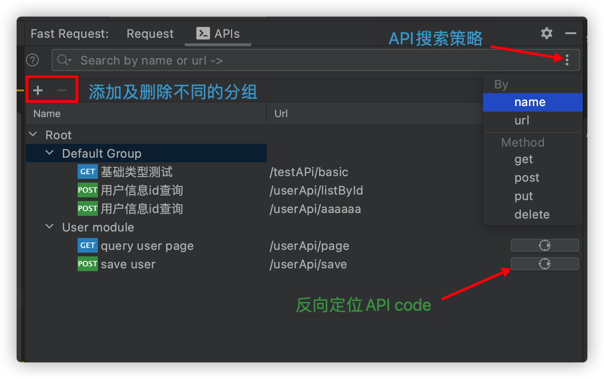
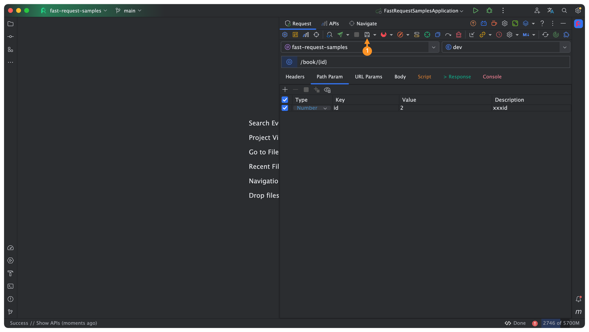
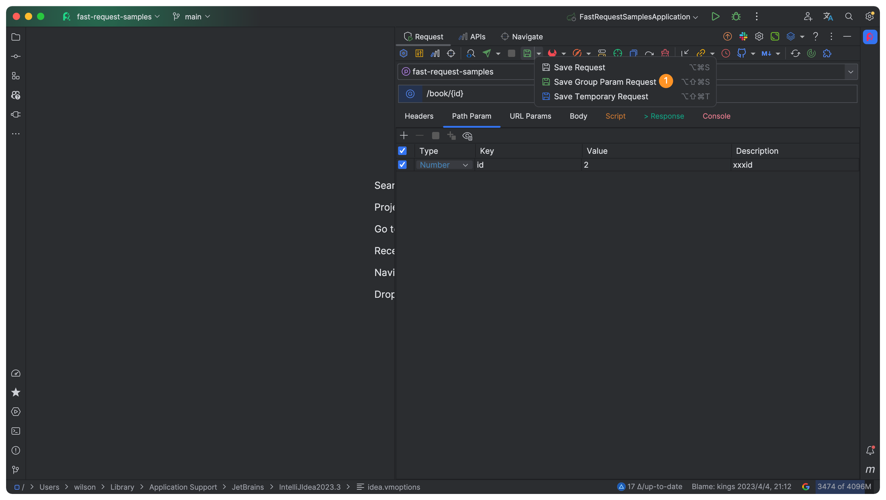
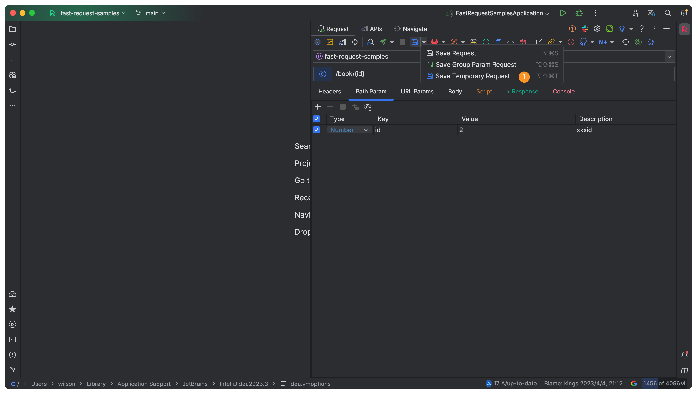
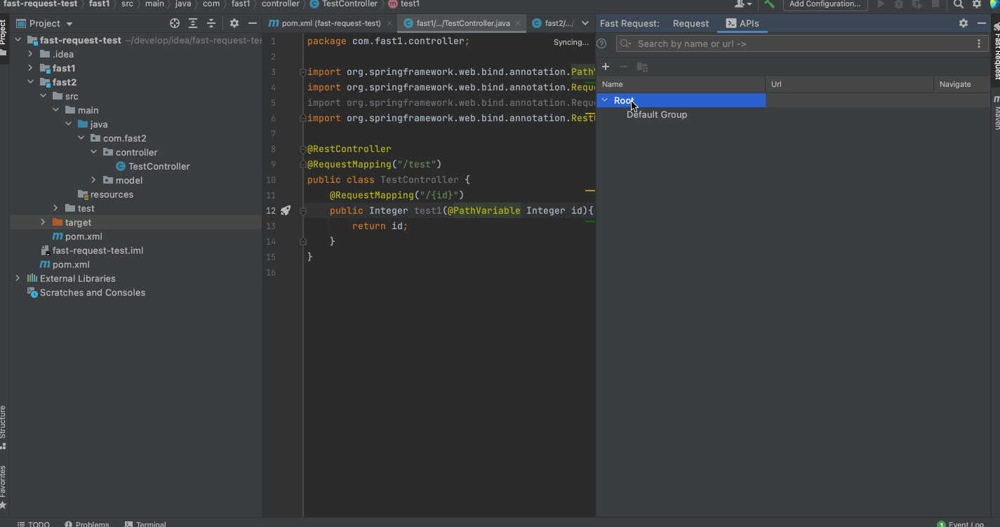
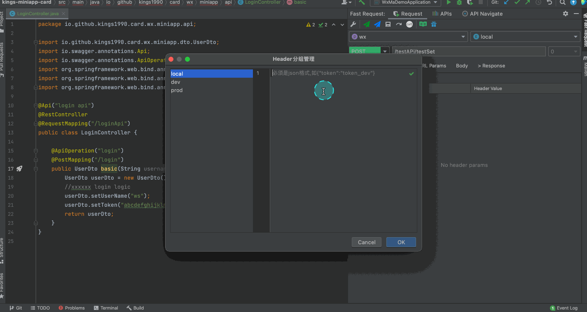
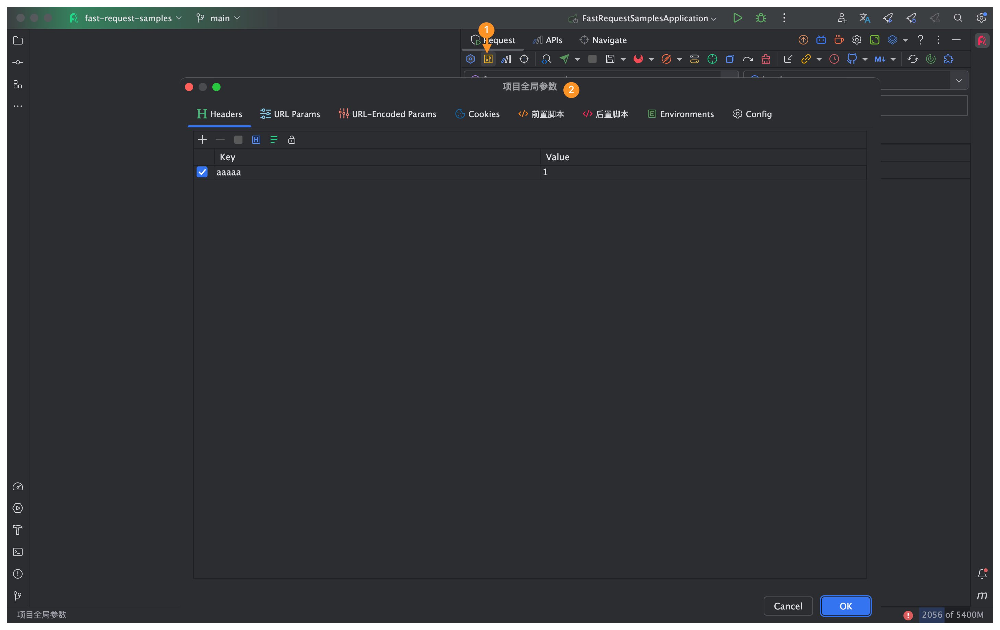

[[toc]]

## 调试API发送请求<Badge text="2.0.0"/>


## SearchEveryWhere支持<Badge text="2.1.1" />

```
输入案例
/url              (查询指定url)
get /list         (指定get方式指定url)
post /save        (指定post方式指定url)
```


## 针对响应是文件的API<Badge text="2.0.2" type="error"/>

点击Send and download



## API导出到Postman<Badge text="2.1.2" type="error"/>


## API列表<Badge text="2.0.1" type="warning"/>

::: tip API列表name取值:

1. 如果方法使用了swagger的@io.swagger.annotations.ApiOperation,则取该注解的value值
2. 如果没有swagger直接修饰,则取方法的javaDoc描述
3. 如果以上都没有则返回New Request

API的name值支持修改
:::




## 保存请求<Badge text="2.0.0"/>

:::tip 特别说明
1.保存的请求默认会放入*Default Group*中,支持拉拽放入别的组,当然最好是加入module分组,请查看api分组自动关联

2.API取名:如果api使用了swagger注解`@ApiOperation("xxx")`,则api取名xxx,如果没加swagger注解,则使用javadoc作为api的名称,否则将取名New Request
```
if (@ApiOperation("xxx"))
    apiName = xxx
else if(java doc)
    apiName = java doc
else 
    apiName = New Request       
```
:::


## API分组参数保存支持<Badge text="2022.2.1"/>
目的:一个API下保存不同组合的参数

==原保存操作将默认归类到Default分组==



**切换参数**

以下是book列表3种语言的查询


## 临时请求保存支持<Badge text="2022.2.1"/>
目的:项目中保存任意不属于本项目的请求,用于临时调用,跟当前项目代码不关联

临时请求保存的Request的Url必须以==http==或者==https==开头




## 重新生成请求<Badge text="2.0.0" type="error"/>
:::tip 特别说明
如果你已经保存一个请求,但是想彻底重新修改其中的参数,那么你可以选择该操作
:::


## CURL 拷贝<Badge text="1.1.4" type="warning"/>
必须是先生成方法url及参数后,点击工具栏


## 快速添加header<Badge text="2.0.0" />
如果你的请求需要一个token而token可以通过一个登陆接口得到,那么你可以不用每次手动添加,只需要访问一下登录接口再通过以下操作来处理


## API分组自动关联<Badge text="2.0.6" type="warning"/>
api分组是为了将保存的api保存到不同分组以便区分不同的api,当处于多模块的项目情况下,支持扫描项目中的module,并且快速得将module添加到分组中,这种方式会将分组添加到root下

**v2.1.2保存api的时候自动创建module group**



:::tip 特别说明
1. 如果没有创建module分组,那么保存请求的时候会将保存的请求放入Default Group
2. 如果创建module分组,那么保存请求的时候会自动根据当前API所处于的module自动归类到对应的Module Group
3. 当然你可以通过拉拽的方式自行移动API到对应的更小的group,并不冲突  
:::

模块支持快速搜索(光标焦点放在列表上输入关键字即可)


## Json语法检查 <Badge text="2.0.6" type="error"/>
右上角提供了json语法检查,如果输入有误会提示对应的错误  
当然也支持格式化等操作


## API导航树<Badge text="2.0.7"/>
```
选中树输入关键字,再按回车或者鼠标左键双击即可定位到API

悬浮鼠标显示api的doc

API Navigate树默认是懒加载的,需要点击刷新按钮,同样每次新增了API你也需要刷新才能得到
懒加载有利于加快idea启动速度
```


## Headers分组<Badge text="2.0.7"/>
```
场景:SpringBoot等多模块项目不同项目、不同环境下头参数不同,为了快速自动切换headers,引入了header分组
操作方式：
1.在headers group里修改约束:输入的值必须是标准json格式
2.直接切换环境，然后再headers表格中输入对应的key、value值
```



## APIs导入导出<Badge text="2022.1.4.0" />
利用改功能,你可以非常方便得将自己已有的APIs分享给别的开发者,或者导入到其他设备上的IDEA

::: danger 注意点
* 导出的时候会新增一个名为fastRequestCollection.xml的xml文件,你不能重命名它, 默认导出到当前项目路径下

* 导入的时候会做默认备份,并且会在.idea文件夹下生成一个名为fastRequestCollection-yyyyMMddHHmmssSSS.xml的文件,
如果是导入误操作,可以通过导入它来还原

* 如果fastRequestCollection.xml不可见,点击file->Reload All from Disk来强制刷新
:::


## swagger默认值解析支持<Badge text="2022.1.4.0" />
已下是一些example

优先级: swagger配置的值 > 配置默认值

:::: code-group

::: code-group-item swagger2
```java
* @ApiParam

@GetMapping(value="/test/{id}")
public String test3(@ApiParam(name = "id",example="2") @PathVariable("id") Integer id) {
    return "";
}

@GetMapping(value="/test/{id}")
public String test3(@ApiParam(name = "id",defaultValue="2") @PathVariable("id") Integer id) {
    return "";
}


* @ApiImplicitParam

@ApiImplicitParams({
    @ApiImplicitParam(paramType="query",name="pageNo",dataType="String",required=true,value="pageNo",defaultValue="1"),
    @ApiImplicitParam(paramType="query",name="pageSize",dataType="String",required=true,value="pageSize",defaultValue="10")
})
@GetMapping(value="/testPage)
public String testPage(@RequestParam("pageNo") Integer pageNo, @RequestParam("pageSize") Integer pageSize) {
    return "";
}


* @ApiModelProperty
@Data
public class UserDto {
    @ApiModelProperty(example = "Bob")
    private String userName;
}
```
:::

::: code-group-item swagger3
```java
* @Parameter

@GetMapping(value="/test/{id}")
public String test3(@Parameter(name = "id",example="2") @PathVariable("id") Integer id) {
    return "";
}

* @Schema(swagger3)

@Data
public class UserDto {
    @Schema(example = "Bob")
    private String userName;
}
```
:::

::::

## API自动生成注释<Badge text="2022.1.5" />
字段注释需要符合标准注释规范,使用`/**描述*/`

可以通过点击隐藏或显示Description


## API生成Markdown文档<Badge text="2022.1.5" />

请注意word形式的API内部采用html来实现的,所以不要觉得奇怪,导出就行

Response Example需要运行你的API后才会被显示


## API一览表预览<Badge text="2022.1.5" />

聚焦窗口后输入关键字,根据API的路径关键字可以快速搜索


## 项目级别全局参数支持<Badge text="2022.1.8" />
支持项目级别内的全局参数,不受多模块影响

配置优先级`api头 > 项目级别全局请求头 > 全局请求头`


:::

## cURL导入<Badge text="2022.2.1" />


==请注意如果需要绑定方法,则需要将光标放置到方法名上==