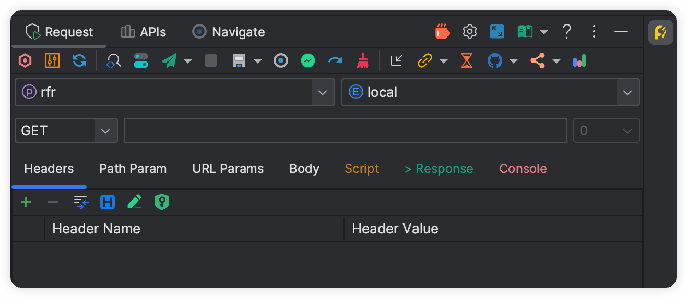

# 功能列表

文档中的图标对应插件中的按钮图标,大标题对应 tab 以及功能

## Request

- [<svg class="icon svg-icon" aria-hidden="true"><use xlink:href="#icon-restfulFastRequest"></use></svg> 让图标动起来](./makeIconMove.md)
- [<svg class="icon svg-icon" aria-hidden="true"><use xlink:href="#icon-search"></use></svg> SearchEveryWhere](./searchEveryWhere.md)
- [<svg class="icon svg-icon" aria-hidden="true"><use xlink:href="#icon-quanjucanshu"></use></svg> 项目级别全局参数支持](./projectValueConfig.md)
- [<svg class="icon svg-icon" aria-hidden="true"><use xlink:href="#icon-localScopeAction"></use></svg> 当前方法定位](./navigateCurrentMethod.md)
- [<svg class="icon svg-icon" aria-hidden="true"><use xlink:href="#icon-send"></use></svg> 调试 API 发送请求](./debugApi.md)
- [<svg class="icon svg-icon" aria-hidden="true"><use xlink:href="#icon-sendDownload"></use></svg> 下载文件](./downloadApi.md)
- [<svg class="icon svg-icon" aria-hidden="true"><use xlink:href="#icon-stop"></use></svg> 终止 API 请求功能](./stopRequest.md)
- [<svg class="icon svg-icon" aria-hidden="true"><use xlink:href="#icon-saveNew"></use></svg> 保存请求](./saveRequest.md)
- [<svg class="icon svg-icon" aria-hidden="true"><use xlink:href="#icon-saveGroup"></use></svg><svg class="icon svg-icon" aria-hidden="true"><use xlink:href="#icon-apiParamGroup"></use></svg> API 分组](./apiGroup.md)
- [<svg class="icon svg-icon" aria-hidden="true"><use xlink:href="#icon-drafting"></use></svg> 临时请求](./tempRequest.md)
- [<svg class="icon svg-icon" aria-hidden="true"><use xlink:href="#icon-regenerate"></use></svg> 重新生成请求](./regenerate.md)
- [<svg class="icon svg-icon" aria-hidden="true"><use xlink:href="#icon-clear"></use></svg> 清除](./clear.md)
- [<svg class="icon svg-icon" aria-hidden="true"><use xlink:href="#icon-import"></use></svg> cURL 导入](./curlImport.md)
- [<svg class="icon svg-icon" aria-hidden="true"><use xlink:href="#icon-curl1"></use></svg> cURL 拷贝](./copyCurl.md)
- [<svg class="icon svg-icon" aria-hidden="true"><use xlink:href="#icon-urlCopy"></use></svg> 一键拷贝 Url](./copyUrl.md)
- [<svg class="icon svg-icon" aria-hidden="true"><use xlink:href="#icon-history"></use></svg> 历史请求预览](./historyRequest.md)
- [<svg class="icon svg-icon" aria-hidden="true"><use xlink:href="#icon-github"></use></svg> <svg class="icon svg-icon" aria-hidden="true"><use xlink:href="#icon-gitee"></use></svg> <svg class="icon svg-icon" aria-hidden="true"><use xlink:href="#icon-gitlab"></use></svg> API文档同步](./apiDocSync.md)
- [<svg class="icon svg-icon" aria-hidden="true"><use xlink:href="#icon-shareDark"></use></svg> API文档分享](./shareApiDoc.md)
- [<svg class="icon svg-icon" aria-hidden="true"><use xlink:href="#icon-wendang"></use></svg> 文档/快速联系](./docAndContact.md)
- [<svg class="icon svg-icon" aria-hidden="true"><use xlink:href="#icon-tool"></use></svg> 管理配置](./settingManager.md)
- [<svg class="icon svg-icon" aria-hidden="true"><use xlink:href="#icon-fullScreen"></use></svg> 全屏](./fullScreen.md)
- [<svg class="icon svg-icon" aria-hidden="true"><use xlink:href="#icon-license"></use></svg> EULA](../eula.md)

----

- [<svg class="icon svg-icon" aria-hidden="true"><use xlink:href="#icon-headerGroup"></use></svg> Headers 分组](./headerGroup.md)
- [<svg class="icon svg-icon" aria-hidden="true"><use xlink:href="#icon-commonHeader"></use></svg> 常用头参数](./commonHeader.md)
- [<svg class="icon svg-icon" aria-hidden="true"><use xlink:href="#icon-basicAuth"></use></svg> Basei auth](./basicAuth.md)
- [<svg class="icon svg-icon" aria-hidden="true"><use xlink:href="#icon-chrome"></use></svg> Html 预览](./htmlPreview.md)

## Apis

- [<svg class="icon svg-icon" aria-hidden="true"><use xlink:href="#icon-ppLib"></use></svg> API 列表](./apiList.md)
- [<svg class="icon svg-icon" aria-hidden="true"><use xlink:href="#icon-postman"></use></svg> API 导出到 Postman](./apiToPostman.md)
- [<svg class="icon svg-icon" aria-hidden="true"><use xlink:href="#icon-export"></use></svg> APIs 导入导出](./apiImportExport.md)
- [<svg class="icon svg-icon" aria-hidden="true"><use xlink:href="#icon-shareDark"></use></svg> 批量导出 API 文档](./batchExportApiDoc.md)

## Navigate

- [<svg class="icon svg-icon" aria-hidden="true"><use xlink:href="#icon-localScopeAction"></use></svg> API 导航树](./apiNavigateTree.md)

## Generate

- [<svg class="icon svg-icon" aria-hidden="true"><use xlink:href="#icon-swagger"></use></svg> Swagger 默认值](./swaggerDefaultValueParse.md)
- [<svg class="icon svg-icon" aria-hidden="true"><use xlink:href="#icon-java"></use></svg> API 自动生成注释](./autoDescription.md)

## Editor

- [<svg class="icon svg-icon" aria-hidden="true"><use xlink:href="#icon-restfulFastRequest"></use></svg> API 一览表预览](./apiPreview.md)
- [<svg class="icon svg-icon" aria-hidden="true"><use xlink:href="#icon-class"></use></svg> Api 注释预览](./apiCommentPreview.md)

## Script

- [<svg class="icon svg-icon" aria-hidden="true"><use xlink:href="#icon-script"></use></svg> 脚本](./script.md)

## Other

- [<svg class="icon svg-icon" aria-hidden="true"><use xlink:href="#icon-add1"></use></svg> 快速添加 header](./quickAddHeader.md)
- [<svg class="icon svg-icon" aria-hidden="true"><use xlink:href="#icon-json"></use></svg> Json 语法检查](./jsonGrammarCheck.md)
