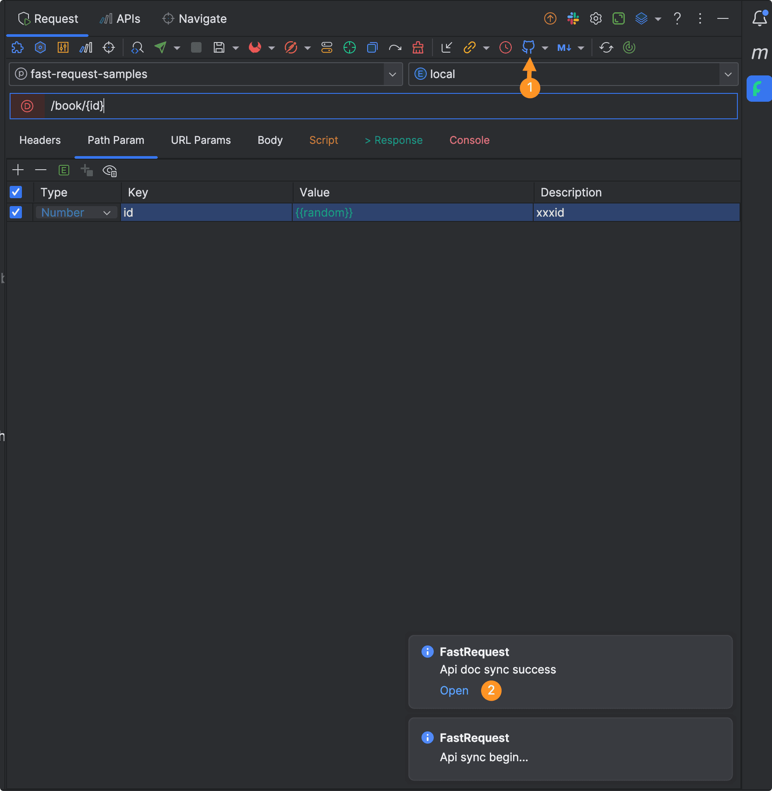
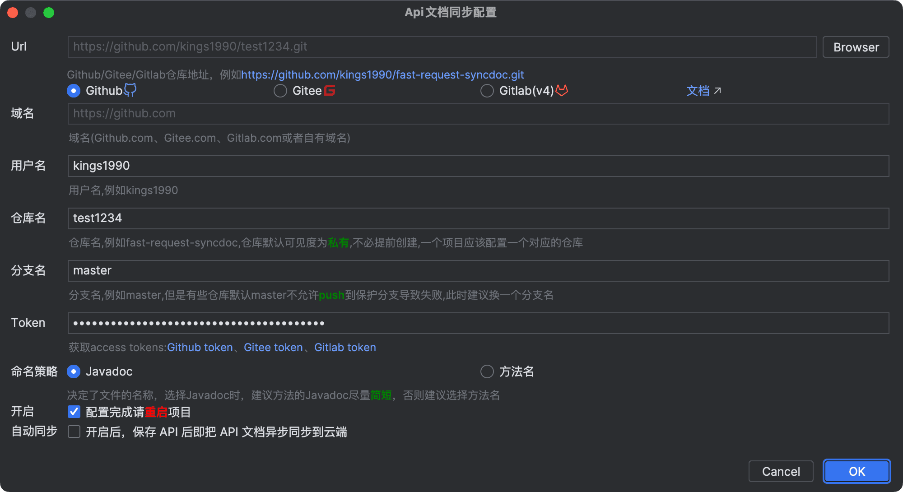

# API文档同步
版本要求: <Badge text="2022.2.7+" />

## 介绍
用于将API文档同步至<svg class="icon svg-icon" aria-hidden="true"><use xlink:href="#icon-github"></use></svg> Github、<svg class="icon svg-icon" aria-hidden="true"><use xlink:href="#icon-gitee"></use></svg> Gitee、<svg class="icon svg-icon" aria-hidden="true"><use xlink:href="#icon-gitlab"></use></svg> Gitlab,
生成在线文档,分享给其他的小伙伴看




## 注意点

* 内网无网络情况下请用私有域名gitlab,gitlab只支持v4不支持其他版本,不行考虑升级
* 如果配置后的仓库在云端不存在,则默认创建==私有==的仓库
* 项目访问404了,解决办法是分享的时候需要将仓库设置为public或者将小伙伴拉至仓库成为某一个成员
* 一个项目对应同步一个仓库,确定好一个仓库并且同步了一部分文档以后,不要再在后面切换修改仓库,历史记录无法同步


## 配置介绍


注意点:命名策略决定了同步至云端的文件名称,文件名称来自Javadoc或者Swagger方法命名注解,如果勾选使用javadoc,请确保Javadoc和Swagger方法命名一定要==简短==,
否则云端的文件名会非常长,这种情况下考虑勾选方法名来同步

## Token
生成的token需要勾选对应的最小权限来支持api同步,同时需要确保token在有时间效期内
```
Gitee:必须勾选projects
Github:必须勾选repo
Gitlab:必须勾选api
```


