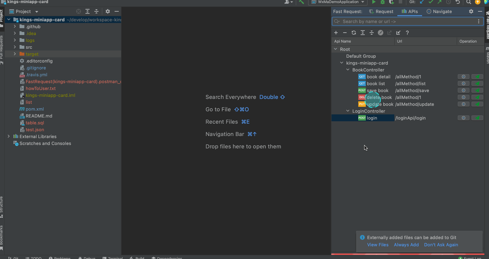

# APIs导入导出
版本要求:<Badge text="2022.1.4.0" />

利用改功能,你可以非常方便得将自己已有的APIs分享给别的开发者,或者导入到其他设备上的IDEA

::: danger 注意点
* 导出的时候会新增一个名为fastRequestCollection.xml的xml文件,你不能重命名它, 默认导出到当前项目路径下

* 导入的时候会做默认备份,并且会在.idea文件夹下生成一个名为fastRequestCollection-yyyyMMddHHmmssSSS.xml的文件,
  如果是导入误操作,可以通过导入它来还原

* 如果fastRequestCollection.xml不可见,点击file->Reload All from Disk来强制刷新
  :::

