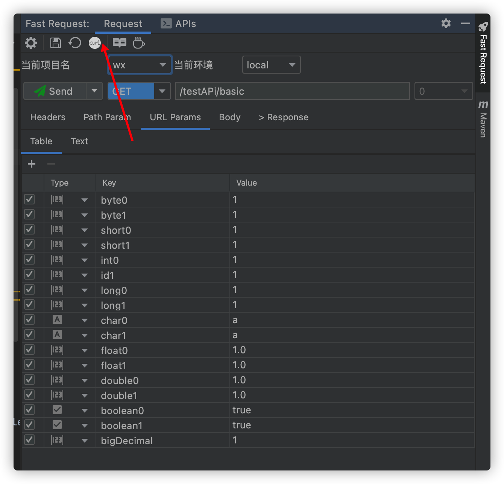

# CURL 拷贝

版本要求： <Badge text="1.1.4" />

必须是先生成方法 url 及参数后,点击工具栏 <svg class="icon svg-icon" aria-hidden="true"><use xlink:href="#icon-curl"></use></svg> 或者<svg class="icon svg-icon" aria-hidden="true"><use xlink:href="#icon-curl1"></use></svg>

