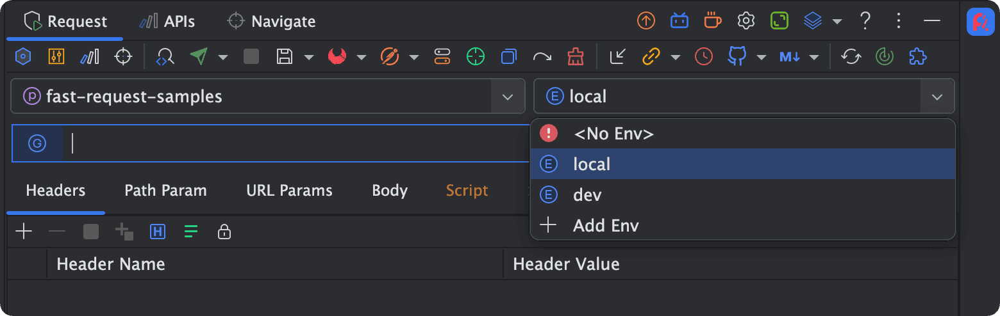
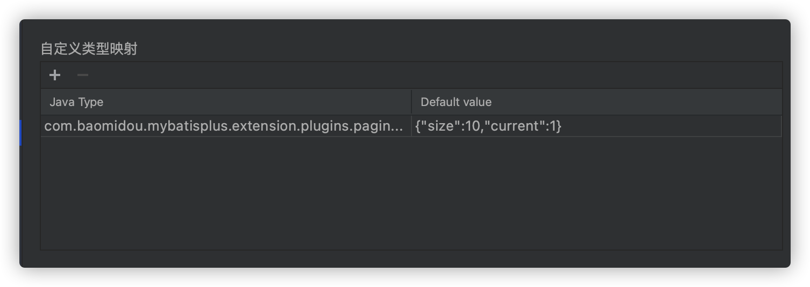

# 快速开始
::: tip 使用入门
Step1:点击配置添加项目名[如微信卡片]和环境名[如local、dev]  
Step2:设置对应项目及环境的域名  
Step3:打开工具窗口(右上角位置),选择当前项目想要启用的环境  
Step4:点击在方法左侧的fastRequest的图标(自动生成参数和url)  
Step5:点击发送请求按钮发送请求  
:::


## 项目/环境/域名
设置映射关系，配置对应项目下对应环境的url前缀地址




## String生成策略
```
策略
* name+random(字段名加随机字符串)
* random(随机字符串)
* none(不生成)
```

::: tip example

:::

## 自定义类型映射
场景:分页实体类`com.baomidou.mybatisplus.extension.plugins.pagination.Page`中有n个属性，但是我只需要size和current

自定义类型映射一共需要设置2个值，即解析的类型以及对应的模板值

**Java Type**为对应的对象类型,必须是包含包名和类名
```java
com.baomidou.mybatisplus.extension.plugins.pagination.Page
```

**Default value**必须是json格式
```json
{"size":10,"current":1}
```

::: tip example

:::

## 默认类型映射
该配置决定java基础类型解析成对应的值，支持修改
::: tip example

:::

## 其他配置

控制器上的url固定变量可以由配置替换,例如类控制器上url写法如下

```java
@RequestMapping("/api/${api-module}/user")
@Controller
public class XxxController(){
  //code ...
}
```

实际的url是`/api/base/user`,那么可以通过以下配置来替换`${api-module}`变量


## 类型ICON映射
图标和类型映射关系

|Icon|Type|
| --- | --- | 
|  |Array  |
| |Object |
| |Number |
| |String |
||Boolean|
||File|