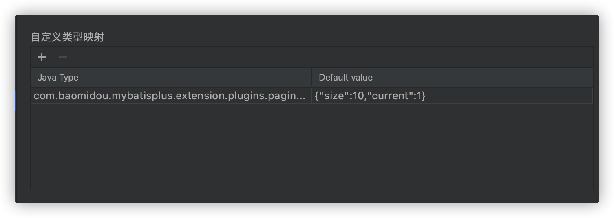
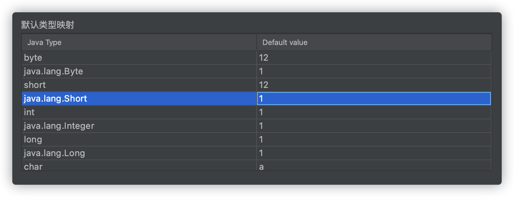
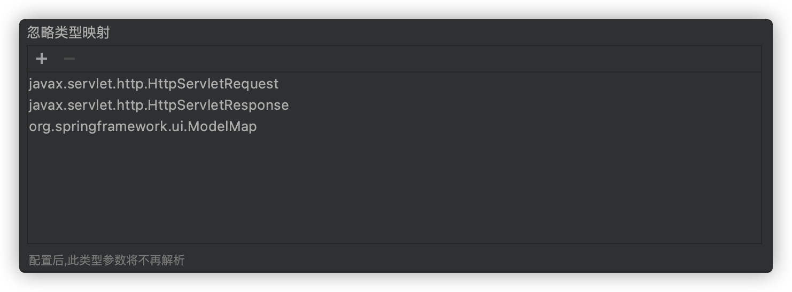

## 自定义类型映射
场景:分页实体类`com.baomidou.mybatisplus.extension.plugins.pagination.Page`中有n个属性，但是我只需要size和current

自定义类型映射一共需要设置2个值，即解析的类型以及对应的模板值

**Java Type**为对应的对象类型,必须是包含包名和类名
```java
com.baomidou.mybatisplus.extension.plugins.pagination.Page
```

**Default value**必须是json格式
```json
{"size":10,"current":1}
```



## 默认类型映射
该配置决定java基础类型解析成对应的值，支持修改



## 忽略类型映射
该配置决定对应的类是否解析,需要配置全路径(packageName+className)

