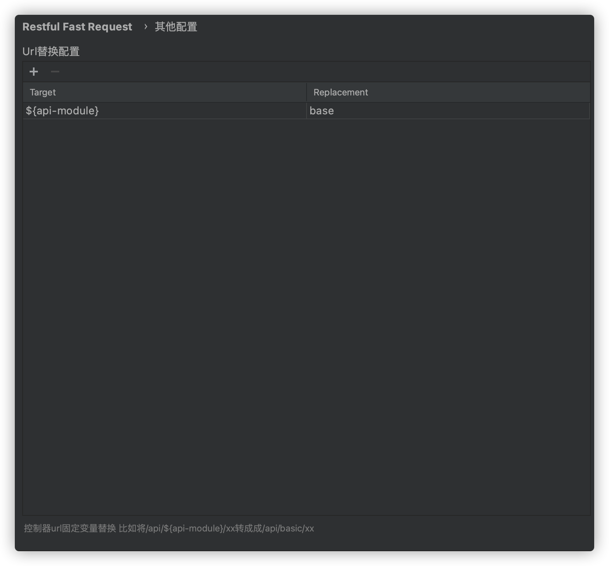

控制器上的url固定变量可以由配置替换,例如类控制器上url写法如下

```java
@RequestMapping("/api/${api-module}/user")
@Controller
public class XxxController(){
  //code ...
}
```

实际的url是`/api/base/user`,那么可以通过以下配置来替换`${api-module}`变量

