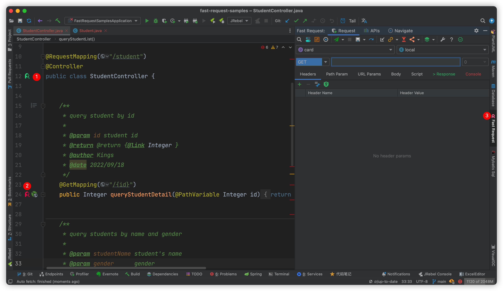

```flow
st=>start: 开始
cfg=>parallel: 配置
op1=>subroutine: 配置项目名
op2=>subroutine: 配置环境名
op20=>operation: 设置域名
op21=>parallel: 返回主界面
op3=>operation: 选择项目名
op4=>operation: 选择环境名
op5=>inputoutput: 点击方法左侧火箭R字图标
op6=>operation: 点击发送按钮
e=>end: 结束|future
st(bottom)->cfg(path1,right)->op1(bottom)->op20->op21(path1,right)->op3->op5
st(bottom)->cfg(path2,left)->op2(bottom)->op20->op21(path2,bottom)->op4->op5
op5->op6->e
```

::: tip 使用入门
* Step1: 点击配置添加项目名[如微信卡片]和环境名[如local、dev]  
* Step2: 设置对应项目及环境的域名  
* Step3: 打开工具窗口(右上角位置),选择当前项目想要启用的环境  
* Step4: 点击在方法左侧的fastRequest的图标<i class="icon iconfont icon-restfulFastRequest"></i>(老图标<i class="icon iconfont icon-restfulFastRequest1"></i>)
* Step5: 点击发送请求按钮发送请求  
:::


新Logo icon <i class="icon iconfont icon-restfulFastRequest"></i>




## 联系我们
如果遇到了问题,请通过一下方式联系我们,将会有更快为你解决问题,同时[进群](../concatGroup.md)将会给与==六折==优惠,群里全部都是==Javaer==,经常会讨论一些技术问题,并且热心,也许可以帮助你==学到一些东西==

||[](https://twitter.com/FastRequest666)|
|------------- |-------|
|||
|如果扫码失败请直接搜微信号==FastRequest99==|欢迎关注官方Twitter|


