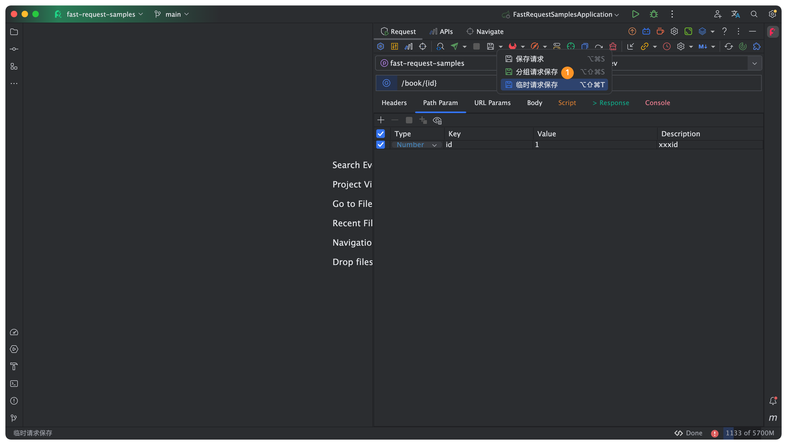
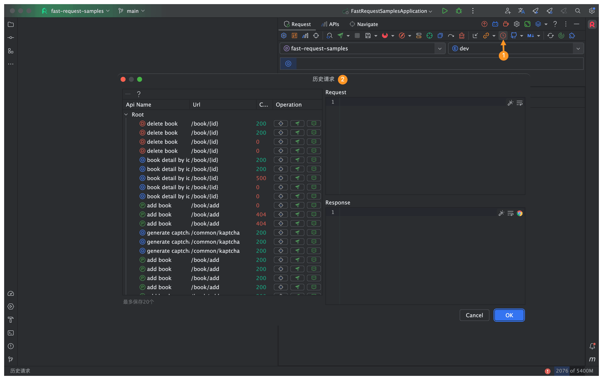
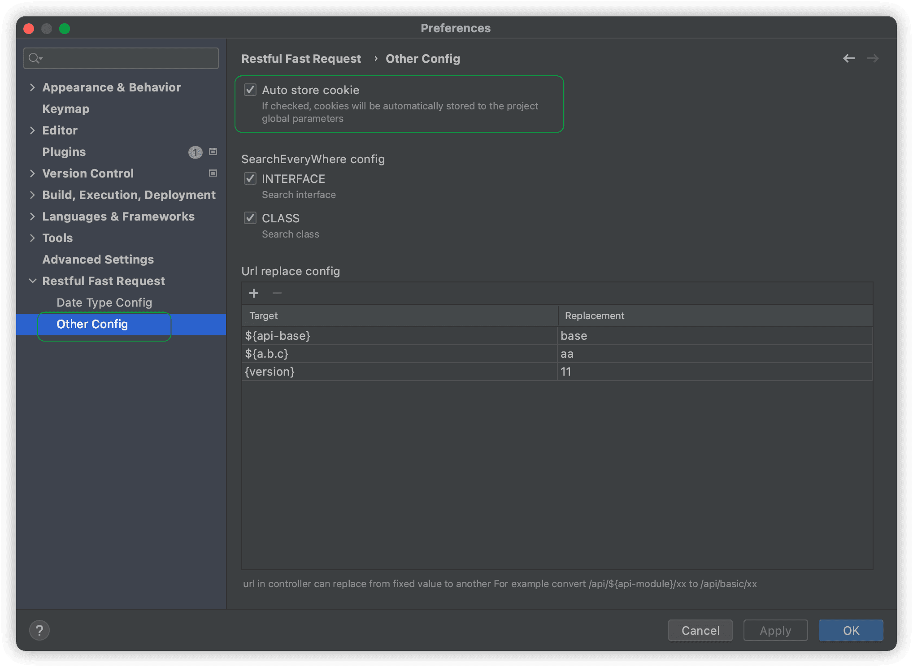
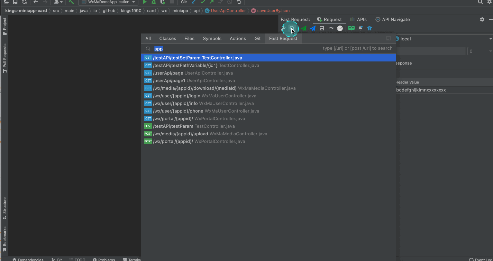
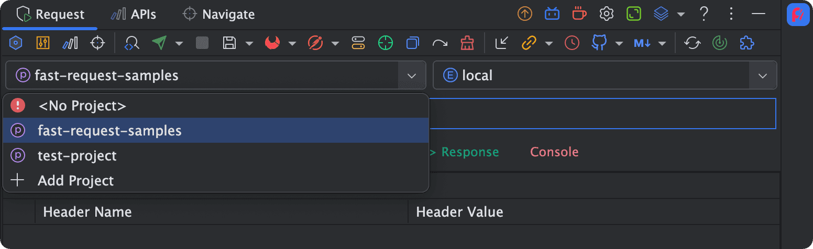
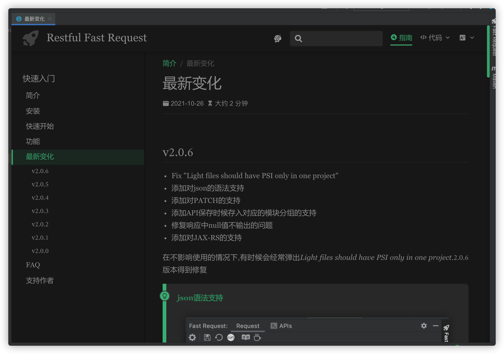

::: danger 公告

==2022.1.4.0== 版本开始收费,购买**License**流程请参考[**购买插件**](./buy.md)

==平台只能挂一个价格,国内用户请进群,一律6折,入正后无烦恼更新==

==技术群二维码==在[*这里*](./concatGroup.md),不仅仅是RFR插件群,更是java技术群!

Issue提报请到[*Github*](https://github.com/dromara/fast-request/issues),作者会一一回应并==认真思考==大家提出的bug以及建议......

---
feat:<Badge text="新功能" type="tip"/>  <span>&nbsp;&nbsp;&nbsp;&nbsp;</span> perf:<Badge text="优化" type="info"/> <span>&nbsp;&nbsp;&nbsp;&nbsp;</span> fix:<Badge text="修复/移除" type="danger"/>
:::

## v2022.2.3 <Badge text="收费" type="tip"/><Badge text="最新版" type="info"/>
* <Badge text="前置脚本" type="tip"/>
* <Badge text="后置脚本" type="tip"/>
* <Badge text="一键拷贝Url" type="tip"/>
* <Badge text="兼容IDEA2021.2.1+" type="info"/>
* <Badge text="RequestParam defaultValue属性解析" type="info"/>
* <Badge text="点击按钮时触发表格单元格值更改" type="info"/>
* <Badge text="关闭RFR工具窗口后点击火箭第一次url无法生成" type="danger"/>
* <Badge text="Jax-rs PATCH支持" type="danger"/>

:::tip 脚本支持
脚本可以让开发者更加灵活地、动态地、方便地修改请求过程的一些入参，以及响应的处理  
具体请参考-------> [脚本](./script.md)


:::

:::tip 一键拷贝Url

:::

::: info 点击按钮时触发表格单元格值更改
==2022.2.3版本之前==在输入表格中的参数时候,若光标还在表格内部,此时去点击操作按钮,某些场景下会报错或者值无法被修改,该问题在此版本得到解决

老版本如何处理: [FAQ:输入参数后调用API发现无效](./faq.md)
:::

## v2022.2.2<Badge text="收费" type="warn"/>
* <Badge text="终止API请求功能" type="tip"/>
* <Badge text="批量导出API文档" type="tip"/>
* <Badge text="导出到Postman添加注释" type="tip"/>
* <Badge text="响应数据量巨大情况下卡顿优化" type="info"/>
* <Badge text="某些场景下的体验和提示" type="info"/>
* <Badge text="新UI及EAP下SearchEveryWhere报错" type="danger"/>
* <Badge text="Multipart修改数字类型参数报错" type="danger"/>
* <Badge text="某些情况下历史请求删除操作报错" type="danger"/>

:::tip 终止API请求功能

:::

:::tip 批量导出API文档

:::

## v2022.2.1<Badge text="收费" type="warn"/>
* <Badge text="API分组参数保存支持" type="tip"/>
* <Badge text="临时请求保存支持" type="tip"/>
* <Badge text="cURL导入支持" type="tip"/>
* <Badge text="Response Header展示" type="tip"/>
* <Badge text="添加对Url尾缀支持" type="tip"/>
* <Badge text="优化快捷键" type="info"/>
* <Badge text="优化解析" type="info"/>
* <Badge text="修复Word导出bug" type="danger"/>

::: tip API分组参数保存支持
目的:一个API下保存不同组合的参数

[B站教程](https://www.bilibili.com/video/BV1zU4y1S7pC?share_source=copy_web&vd_source=c46db3e7c134b1948dabbea9717a72ac)

==原保存操作将默认归类到Default分组==

如何操作:输入参数后点击==分组请求保存==




**切换参数**

以下是book列表3种语言的查询


:::

::: tip 临时请求保存支持
目的:保存任意不属于本项目的请求,用于临时调用,跟当前项目代码不关联

临时请求保存的Request的Url必须以==http==或者==https==开头


:::

::: tip cURL导入支持


==请注意如果需要绑定方法,则需要将光标放置到方法名上==
:::


::: tip Response Header展示


:::

::: tip 添加对Url尾缀支持

目的:有些请求需要在url结尾加上.do


:::

::: info 优化解析
优化了`List<Entity>`的解析
:::

## v2022.1.10<Badge text="收费" type="warn"/>
* <Badge text="添加对历史请求预览的支持" type="tip"/>
* <Badge text="超时时间自定义设置" type="tip"/>
* <Badge text="SearchEveryWhere支持方法注释搜索" type="info"/>
* <Badge text="快捷键冲突优化" type="info"/>
* <Badge text="文本编辑器字符显示光标定位优化" type="info"/>
* <Badge text="Curl输出格式优化" type="info"/>
* <Badge text="优化@Consumes(APPLICATION_JSON)不生效问题(JAX-RS)" type="info"/>

::: tip 添加对历史请求预览的支持
隐藏技能:双击记录可以展示详情

:::

::: tip 超时时间自定义设置
默认: 60秒

:::

::: info SearchEveryWhere支持方法注释搜索
支持注释搜索API

:::


::: info 优化
* <Badge text="快捷键冲突优化" type="info"/>
  * <Badge text="将打开创建的三个快捷键统一加上了Shift" type="info"/>
* <Badge text="文本编辑器字符显示光标定位优化" type="info"/>
  * <Badge text="文本编辑器生成字符串的时候默认聚焦到第一行" type="info"/>
:::


## v2022.1.9<Badge text="收费" type="warn"/>
* <Badge text="工具窗口跳转增加快捷键" type="tip"/>
* <Badge text="添加自动添加Cookie支持" type="tip"/>
* <Badge text="响应raw中增加html预览" type="tip"/>
* <Badge text="APIs列表视图优化" type="info"/>
* <Badge text="忽略字段解析优化" type="info"/>
* <Badge text="泛型参数解析支持" type="info"/>
* <Badge text="完善项目全局参数" type="info"/>
* <Badge text="修复编辑参数时同时按删除参数导致报错" type="info"/>
* <Badge text="界面优化" type="info"/>
* <Badge text="保存API插入顺序优化" type="info"/>
* <Badge text="优化了导出预览" type="info"/>

::: tip 工具窗口跳转增加快捷键
提供了快捷键可以快速跳转,可以在`setting->Keymap`中修改

:::

::: tip 添加自动添加Cookie支持
开启此配置,cookie再自动存入==项目全局参数==中的`cookies`中,此配置默认开启

:::

::: tip 响应raw中增加html预览
raw中不再截断html返回类型的响应,同时可以对html进行预览


:::

::: info 忽略字段解析优化
* <Badge text="忽略解析使用`@JsonIgnore`、`@JSONField(serialize = false)`注解的字段" type="info"/>
* <Badge text="忽略解析`transient`关键字修饰的字段" type="info"/>
:::

::: info 泛型参数解析支持
支持此类泛型参数解析
```java
@Data
public class CommonDTO<T,R> implements Serializable {
    private String accessToken;
    private String appKey;
    private String clientId;
    private T data;
    private List<R> dataList;
}

@PostMapping(value = "/apply")
public Integer loanApply(@RequestBody CommonDTO<Book, TestDTO> req){
    return 1;
}
```
:::

::: info 完善项目全局参数
加入了`URL Params`、`URL-Encoded Params`、`Cookies`

:::


::: info 优化
* 界面优化
  * 优化了tab间距(windows下不正常)、背景颜色、个别突出的tab颜色等
* 保存API插入顺序优化
  * 后保存的放在最上面
:::


::: info APIs列表视图优化
渲染进行了优化,新保存的api图标会自动优化,历史保存的api可以右键进行选择变更

:::

## v2022.1.8<Badge text="收费" type="warn"/>
* <Badge text="项目级别全局参数支持" type="tip"/>
* <Badge text="优化响应数据快速添加到头" type="info"/>
* <Badge text="优化cookie快速添加到头" type="info"/>
* <Badge text="Postman导出优化" type="info"/>
* <Badge text="修复navigate树扫描bug" type="info"/>
* <Badge text="修复了一些bug" type="danger"/>

::: tip 项目级别全局参数支持
支持项目级别内的全局参数,不受多模块影响

配置优先级`api头 > 项目级别全局请求头 > 全局请求头`


:::

::: info 快速添加到头参数

原响应结果从添加到 ~~全局请求头~~ 变更为添加到 ==项目全局请求头==,cookie也是如此


:::


## v2022.1.7<Badge text="收费" type="warn"/>
* <Badge text="Kotlin spring系列框架支持" type="tip"/>
* <Badge text="新增SearchEveryWhere范围搜索策略" type="tip"/>
* <Badge text="编辑器ToggleUseSoftWrap支持" type="tip"/>
* <Badge text="响应数据一键添加Global Header支持" type="tip"/>
* <Badge text="添加导航到当前方法的支持" type="tip"/>
* <Badge text="优化多模块下保存的API回显自动绑定项目" type="info"/>


::: tip Kotlin spring系列框架支持
添加了Kotlin语言下,Spring系列框架支持

:::

::: tip 新增SearchEveryWhere范围搜索策略
2022.1.7版本默认可以搜索到feign或者controller中的mapping

默认搜索策略是根据注解来搜索的,再提供2种选项,如果在搜索过程中需要排除类似feign中的接口,可以通过去除Interface的勾选来处理.

:::

::: tip 编辑器ToggleUseSoftWrap支持


:::

::: tip 响应数据一键添加Global Header支持
多模块项目下建议使用,因为Add to Headers只能添加到当前模块项目下


:::

::: tip 添加导航到当前方法的支持
当你生成好方法的url以后,又切换到代码中的别的地方,然后又想开始调试该API方法,可以通过此功能快速定位到代码


:::

::: info 优化多模块下保存的API回显自动绑定项目
优化了**多模块**下下针对保存的api回显需要**手动切换项目下拉框**
:::

## v2022.1.6<Badge text="收费" type="warn"/>
* <Badge text="添加一键添加Cookie到Header的支持" type="tip"/>
* <Badge text="添加API分享Word和html的支持" type="tip"/>
* <Badge text="修复了Basic authorization没有携带Basic字符串" type="danger"/>
* <Badge text="移除了APIs标签下的拉拽功能" type="danger"/>

::: tip 添加一键添加Cookie到Header的支持

针对登录需要Cookie支持的,可以将响应中的Cookie快速添加到Header来实现


:::

::: tip 添加API分享Word和html的支持

请注意word形式的API内部采用html来实现的,所以不要觉得奇怪,导出就行


:::

[comment]: <> (::: note 添加YouTrack跟踪bug支持)

[comment]: <> (Fast Request接通了YouTrack Issue自动上报的功能,直接点击上报bug即可反馈问题,无需手动再复制粘贴到Github提报bug)

[comment]: <> (Fast Request YouTrack官方网址: [https://darkings.youtrack.cloud/issues]&#40;https://darkings.youtrack.cloud/issues&#41;)

[comment]: <> (![youtrackSubmit]&#40;../.vuepress/public/img/youtrackSubmit.png&#41;)

[comment]: <> (:::)


## v2022.1.5<Badge text="收费" type="warn"/>

* <Badge text="添加对自动生成参数描述的支持" type="tip"/>
* <Badge text="添加一键生成API文档的支持" type="tip"/>
* <Badge text="添加单个类的API整体预览" type="tip"/>
* <Badge text="移除了Accept头上的text/html" type="danger"/>
* <Badge text="修复了一些bug" type="danger"/>

::: tip 添加对自动生成参数描述的支持

可选择性的对描述进行隐藏


:::

::: tip 添加一键生成API文档的支持

点击生成参数后,可通过分享直接生成Markdown文档


:::

::: tip 添加单个类的API整体预览

聚焦窗口后输入关键字可快速定位


:::


## v2022.1.4 <Badge text="收费" type="warn"/>
==idea版本2021.3+==

* <Badge text="APIs导入导出支持" type="tip"/>
* <Badge text="APIs支持直接运行" type="tip"/>
* <Badge text="API请求增加超时设置" type="tip"/>
* <Badge text="url生成优化之多url随机生成" type="tip"/>
* <Badge text="自动生成参数可选化" type="tip"/>
* <Badge text="swagger注解默认值参数解析支持" type="tip"/>
* <Badge text="兼容idea 2022.1" type="info"/>
* <Badge text="SearchEveryWhere高亮优化" type="info"/>
* <Badge text="对Send和Send and Download按钮进行了合并" type="info"/>
* <Badge text="APIs界面优化" type="info"/>
* <Badge text="Tab页API Navigate重命名Navigate" type="info"/>
* <Badge text="使用引导上的细节优化" type="info"/>
* <Badge text="修复了Light files should have PSI only in one project" type="danger"/>

::: info SearchEveryWhere高亮优化
高亮展示搜索关键字,加快真实想要查找的API的查找速度,同时展示api对应的javadoc

:::

::: tip APIs导入导出支持
增加对APIs的导入导出支持,利用改功能,你可以非常方便得将自己已有的APIs分享给别的开发者,或者导入到其他设备上的IDEA


更多详情请看 **[功能->APIs导入导出](./feature.md#apis导入导出)**
::: 

::: tip APIs支持直接运行
你可以在APIs tab页直接运行你保存的请求


:::


::: info 自动生成参数可选化

:::

::: tip swagger注解默认值参数解析支持
增加了swagger注解默认值的解析,该功能对于入参的传递更加人性化
* @ApiParam(swagger2)
* @ApiImplicitParam(swagger2)
* @ApiModelProperty(swagger2)
* @Parameter(swagger3)
* @Schema(swagger3)


更多详情请看 **[功能->swagger默认值解析支持](./feature.md#swagger默认值解析支持)**
:::

:::info 对Send和Send and Download按钮进行了合并
对按钮进行了合并,因为常见的操作都是非下载操作,减少了工具栏按钮个数,看上去更加简捷

:::

::: info 使用引导上的细节优化
我们在不同的操作窗口,增加?选项用来展示一些注意事项及操作指引,对于初次使用的用户,操作门槛更低

并且随着版本的迭代,后续可能会加入更多的提示操作指引


:::


::: info url解析优化

历史逻辑只会取第一个url即test1,考虑到实际使用中,有可能你需要的是另外一个url,所以添加了随机支持

以下demo,url将随着点击<i class="icon iconfont icon-restfulFastRequest"></i>随机生成 **/url1/test1,/url1/test2,/url2/test1,/url2/test2**
```java
@RequestMapping({"url1","url2"})
@RestController
public class MultiUrlController {
    @GetMapping(value = {"test1","test2"})
    public Integer testUrl(){
        return 1;
    }
}
```

支持变量计算,以下demo将生成 **/url/public/test1**
```java
public class Constant {
    public static final String PUBLIC_URL = "/public";
}
@RequestMapping("url")
@RestController
public class MultiUrlController {
    @GetMapping(value = Constant.PUBLIC_URL + "/test1")
    public Integer testUrl(){
        return 1;
    }
}
```
:::

::: info Tab页API Navigate重命名Navigate  
在工具窗口比较小的情况下,API Navigate会被隐藏,为了在尽可能小的工具窗口展示更多内容,所以命名更加简短
:::


## v2.1.3
* 参数特殊符号编码支持
* curl加入global headers

## v2.1.2

* 添加对导出api到Postman的支持
* 首次打开idea懒加载API Navigate树
* SearchEveryWhere module标识
* Url解析优化
* API navigate tree展示优化
* API保存分组优化
* 全局请求头支持

::: tip Url解析优化
支持以下example的解析

不再需要单独配置url replace config
:::


:::: code-group

::: code-group-item 场景1:url是类常量引用

```java
@RequestMapping(Url1.URL_TEST)
@RestController
public class UrlTestController {
    private static final String URL= "xxx";

    @GetMapping(value = URL)
    public Integer testUrl(){
        return 1;
    }
}
```

:::

::: code-group-item 场景2:value是一个数组

```java
@RequestMapping(
    value = {"/v1/save"},
    method = {RequestMethod.POST}
)
```

:::

::::

:::tip 添加对导出api到Postman的支持


:::

:::tip SearchEveryWhere module标识


:::

:::tip API保存分组优化

```
保存api的时候,api将会保存到对应的请求指定到控制器名所在的分组(更加直观)
```


:::

:::tip 全局请求头支持


:::

## v2.1.1

* SearchEveryWhere支持
* 增加一个最新按钮可以随时查看最新版本
* 优化枚举的解析
* 增加对http重定向的支持

:::tip SearchEveryWhere support

```
输入案例
/url              (查询指定url)
get /list         (指定get方式指定url)
post /save        (指定post方式指定url)
```


:::

:::info 最新版本快速查看

:::

## v2.1.0.2

* 加入了组织[**Dromara**](https://dromara.org/zh/)(致力于微服务云原生解决方案的组织)

## v2.1.0.1

* 修复Get参数错误

## v2.1.0

* 修复POST形式的API中@RequestBody、@RequestParam混合使用参数解析导致请求400异常
* 对嵌套类的解析支持
* 增加支持对控制器类级别@RequestMapping(path="/xxx")path的解析
* Api tree针对带@RequestMapping类的扫描支持

## v2.0.9

* 2021.3+版本修复"Slow operations are prohibited on EDT"
* 修复快速从response添加Headers
* 添加项目级别的配置,切换项目env和project不受变化
* 文本编辑器添加了快捷格式化按钮

:::tip 从response添加Headers

```
如果你的api需要再header里面塞入token,你可以像这样子从响应里面快速加参数塞入headers
```


:::

:::tip 文本编辑器添加了快捷格式化按钮

:::

## v2.0.8.1

* 修复searchEveryWhere冲突警告
* 调整低版本idea工具栏操作按钮至工具栏顶部位置
* 移除多余依赖,插件从11.1M降至5.9M

## v2.0.8

* 修复初次添加项目或环境npe
* json树响应字符渲染最大限制
* 添加Api navigate对methodType的支持
* 添加对忽略参数解析的支持
* 线程导致的EDT问题
* send/sendDownload支持自定义快捷键
* 修复2021.3响应不显示

:::tip send/sendDownload支持自定义快捷键

```
快捷键在任意位置点击均可触发,不再需要聚焦到工具窗口
```


:::

:::tip 添加Api navigate对methodType的支持


:::

## v2.0.7

* 添加API导航树
* 添加Headers随项目和环境切换自动切换的支持
* 优化windows系统某些情况下下载文件无法弹出目录
* 优化@RequestParam的参数解析
* 优化工具窗口project和env下拉组件及布局
* curl拷贝提示优化
* regenerate提示优化
* 删除project和env配置增加确认操作
* 修复json字段输出循序被打乱
* 将发送请求按钮至工具栏同时支持快捷键

:::tip API导航树
```
选中树输入关键字,再按回车或者鼠标左键双击即可定位到API

悬浮鼠标显示api的doc
```


:::

:::tip Headers自动切换
```
场景:SpringBoot等多模块项目不同项目、不同环境下头参数不同,为了快速自动切换headers,引入了header分组
操作方式：
1.在headers group里修改约束:输入的值必须是标准json格式
2.直接切换环境,然后再headers表格中输入对应的key、value值
```


:::

:::tip 优化@RequestParam的参数解析
@RequestParam注解的参数将优先按照别名  
`@RequestParam("nameAlias")List<String> nameList` 输入参数将变成nameAlias  
:::

:::tip 将发送请求按钮至工具栏同时支持快捷键
```
send request: alt =
send and download: alt -
前提条件:工具窗口需要被聚焦
```


:::

:::tip 优化工具窗口project和env下拉组件及布局
```
图标p代表project
图标e代表environment  
```




:::

## v2.0.6
* Fix "Light files should have PSI only in one project"
* 添加对json的语法支持
* 添加对PATCH的支持
* 添加API保存时候存入对应的模块分组的支持
* 修复响应中null值不输出的问题
* 添加对JAX-RS的支持
* 最新功能展示

在不影响使用的情况下,有时候会经常弹出*Light files should have PSI only in one project*.2.0.6版本得到修复

::: tip json语法支持

:::

::: tip 添加API保存时候存入对应的模块分组的支持


同时模块支持快速搜索

:::

::: tip JAX-RS的支持

:::

::: tip 最新功能展示  
只会展示一次

:::

## v2.0.5

* JSON内置编辑器支持
* 修复全选参数框隐藏问题
* 修复API回显Headers参数异常
* 优化了请求进度条显示

## v2.0.4

* 修复因response内容过道导致的界面错乱问题
* Response json超长显示优化
* 优化图标尺寸
* 中文文档迁移至gitee

## v2.0.3

* 删除API的时候增加了确认
* 添加了参数全选反选的功能
* 修复诸如【@RequestParam(value="address[]") Set address】的参数解析
* 修复快速添加headers界面错乱

## v2.0.2

* 修复项目多开情况下A请求显示到B项目
* 修复@ResponseBody修饰的数组与集合解析问题
* 修复List参数无泛型解析问题
* 添加对文件下载的支持
* 发送请求时展示进度条
* 全新的document,点击工具栏doc图标
* 一些优化

## v2.0.1

* rename from Fast Request to Restful Fast Request
* Json、Form URL-Encoded、Multipart Tab合并减小工具窗口宽度
* 修复全局配置下修改配置报错
* 将get、post、delete、put图标添加到保存的请求
* 保存的请求支持更多搜索策略
* tab重命名collection->APIs
* YearMonth解析支持

## v2.0.0

* 支持请求的存储
* 支持参数可选
* 优化了UI
* 修复了一些bug