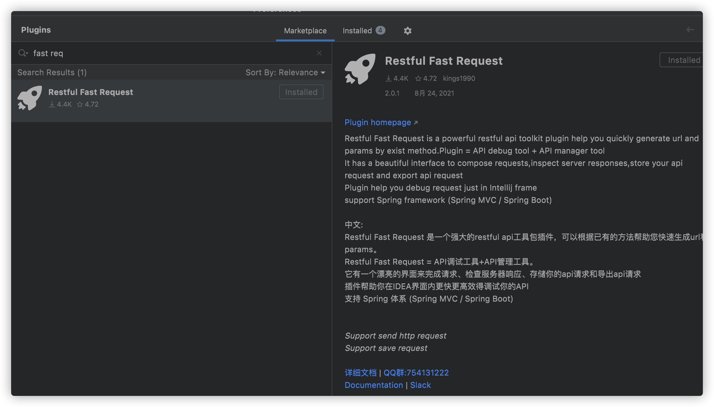
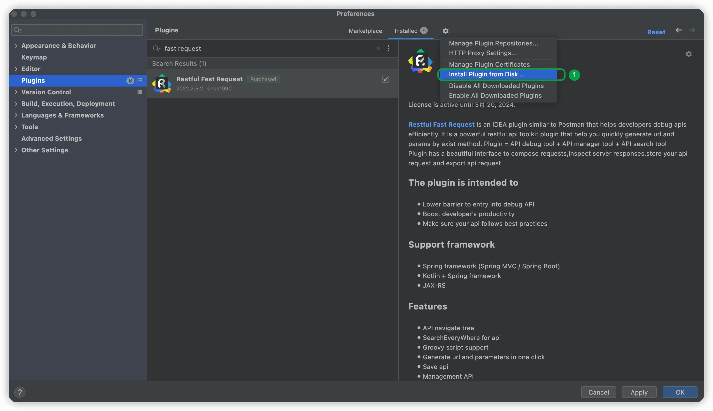

## 安装
==请不要安装其他类似插件,引起冲突或者数据丢失概不负责==

- 方式 1: 在线安装(推荐). IDEA 插件市场搜索 Restful Fast Request 并安装

- 方式 2: 离线安装.适用内网使用或者体验版使用

a. 前往[https://plugins.jetbrains.com/plugin/16988-restful-fast-request/versions](https://plugins.jetbrains.com/plugin/16988-restful-fast-request/versions)下载安装包

b. 前往`setting -> plugins -> Install plugin from disk`

c. 选择下载好的安装包并重启(==请不要解压压缩包==)

## EAP
==IDEA版本2021.2+==

eap版本为抢先版本,可能会相对不大稳定,但是很多用户希望提前使用一些高级的功能,那么可以尝试使用.

eap版本需要先去下载对应的eap压缩包,安装请参考方式 2,忽略步骤a

[前往下载](https://plugins.jetbrains.com/plugin/16988-restful-fast-request/versions/eap)

::: danger 注意
使用eap版本的时候需要注意,一般低版本升级到高版本的eap不大会出什么问题,但是从高版本的eap版本降级到低版本的稳定版本,eap版本中一些新的功能保存的数据,
可能会丢失
:::
