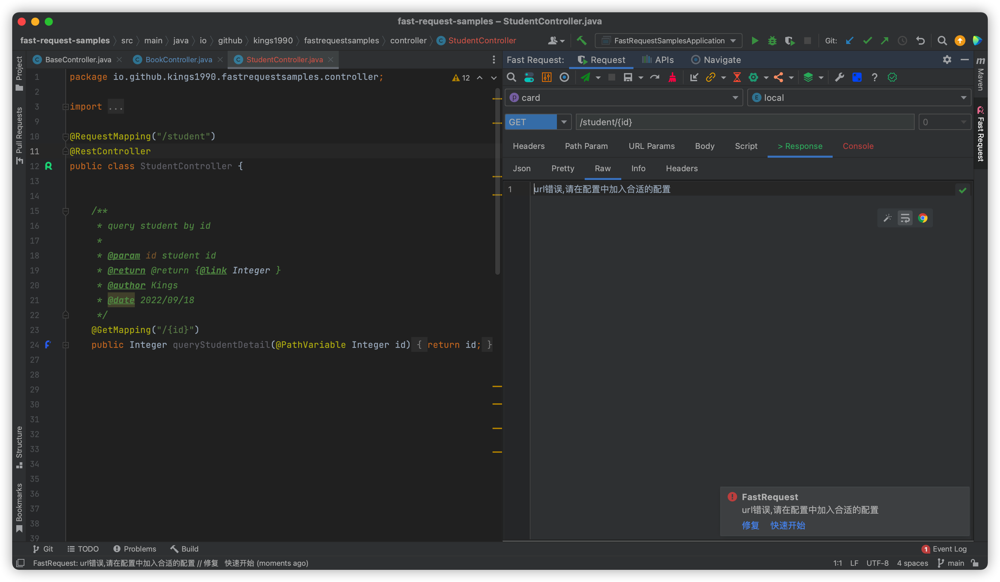

==有关好的技巧分享,请加入群聊积极参与==

[[toc]]

## Url 错误

<Badge text="解决办法" type="tip" />
1. 配置正确的域名,并启用项目和环境2个下拉框
2. 设置正确的url,例如需要将url上的变量{id}替换,可以在Path Param tab中替换变量

## 多文件上传

输入多个值并将字段类型设置为 file

## Body 中想直接传 text

在 header 中加入**Content-Type: text/plain**

考虑使用[常用头参数](./features/commonHeader.md)快速添加

## 没有 Controller,如何发送请求

参考[临时请求](./features/tempRequest.md)
