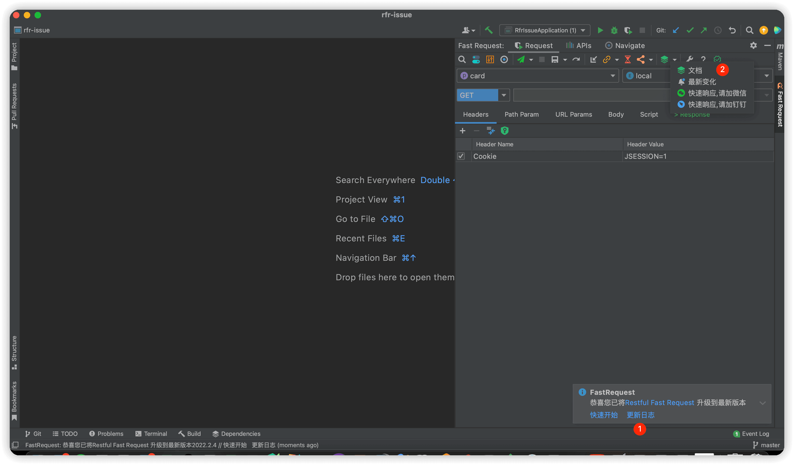

## 优势
1. 本软件下载量  
2. ==每次==软件更新均会在软件内部推送更新链接,告知用户==返回网站==查看相关的更新日志
3. 软件内部增设文档按钮可以==快速返回网站首页==,促使开发者前往网站查看功能
4. 开发者也会让软件用户主动先去看文档,再提问

综上因素,赞助者将在本站有更大机会得到曝光.

## 我要赞助
如果您口袋充裕，扫以下的赞助码（注意微信号是==FastRequest99==），即可成为**Restful Fast Request**的赞助者。

1. 扫码添加微信，添加好友时请备注：==赞助==
2. 好友添加成功后请发送赞助支付截图

## 赞助者福利

1. 赞助达 <Badge text="30" type="danger"/> 元，您将获得 Restful Fast Request [赞助列表](./sponsorList.md) 的**留名**.并可**投放推广链接**（永久）
2. 赞助达 <Badge text="299" type="tip"/> 元/年，可按需直接干几年，您将获得 Restful Fast Request 文档 [首页](../README.md) 的赞助商**广告展示**栏位，以及 [赞助列表](./sponsorList.md) 位展示（永久）

赞助列表**排序规则**:==按照赞助费从大到小排序==

## 首页上墙需提供的资料
提供Logo和对应文案，链接

## 赞助列表效果
赞助人         | 金额 |他的分享及留言|赞助时间
------------- | -------------| -------------| -------------
[Kings](https://space.bilibili.com/370110042)|100|[Fast Request](https://dromara.gitee.io/fast-request),API调试神器|2022-08-21

