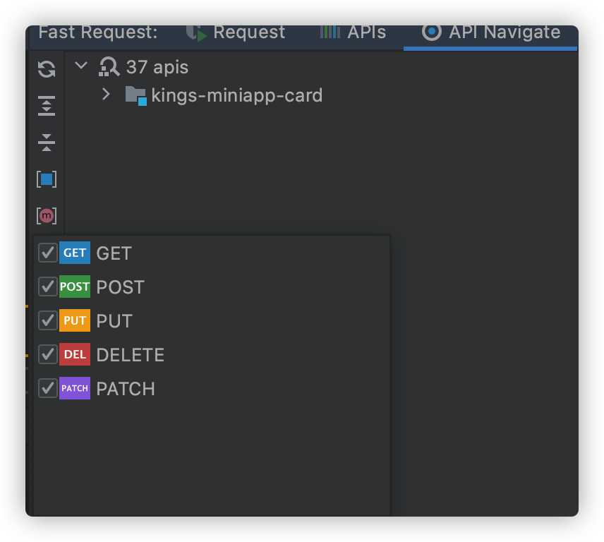
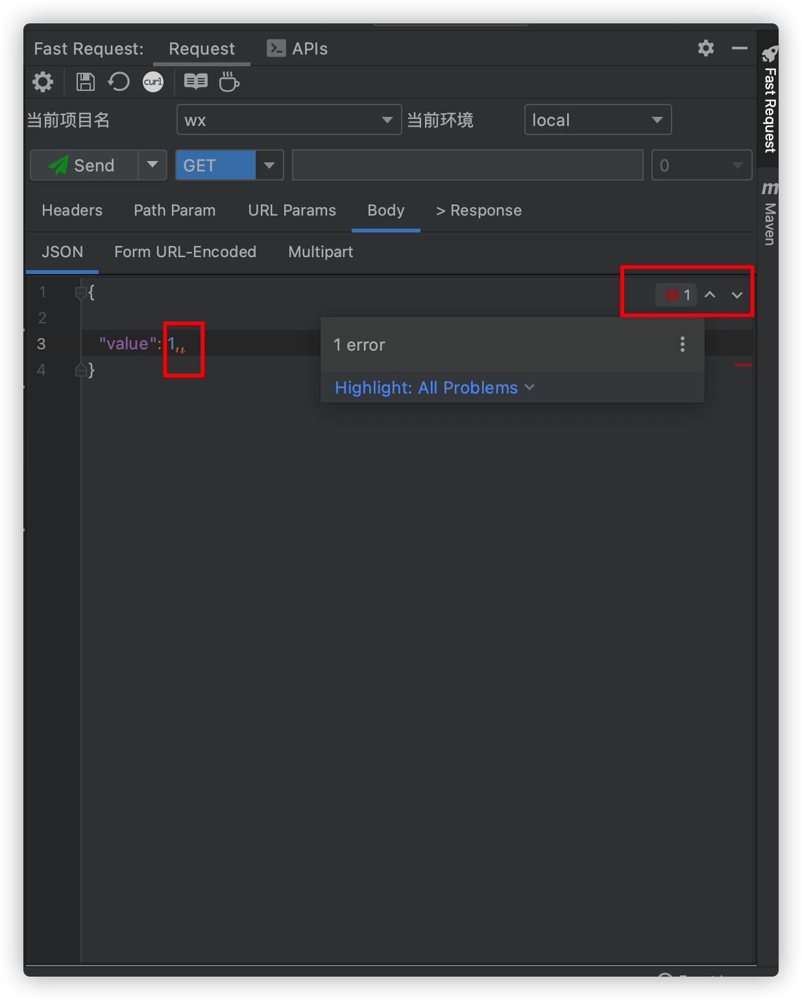

# 最新变化

## v2.0.8

* 修复初次添加项目或环境npe
* json树响应字符渲染最大限制
* 添加Api navigate对methodType的支持
* 添加对忽略参数解析的支持
* 线程导致的EDT问题
* send/sendDownload支持自定义快捷键
* 修复2021.3响应不显示

:::tip send/sendDownload支持自定义快捷键

```
send request: ctrl alt =
send and download: ctrl alt -

快捷键在任意位置点击均可触发,不再需要聚焦到工具窗口
```


:::

:::tip 添加Api navigate对methodType的支持


:::

## v2.0.7

* 添加API导航树
* 添加Headers随项目和环境切换自动切换的支持
* 优化windows系统某些情况下下载文件无法弹出目录
* 优化@RequestParam的参数解析
* 优化工具窗口project和env下拉组件及布局
* curl拷贝提示优化
* regenerate提示优化
* 删除project和env配置增加确认操作
* 修复json字段输出循序被打乱
* 将发送请求按钮至工具栏同时支持快捷键

:::tip API导航树
```
选中树输入关键字,再按回车或者鼠标左键双击即可定位到API

悬浮鼠标显示api的doc
```


:::

:::tip Headers自动切换
```
场景:SpringBoot等多模块项目不同项目、不同环境下头参数不同,为了快速自动切换headers,引入了header分组
操作方式：
1.在headers group里修改约束:输入的值必须是标准json格式
2.直接切换环境,然后再headers表格中输入对应的key、value值
```


:::

:::tip 优化@RequestParam的参数解析
@RequestParam注解的参数将优先按照别名  
`@RequestParam("nameAlias")List<String> nameList` 输入参数将变成nameAlias  
:::

:::tip 将发送请求按钮至工具栏同时支持快捷键
```
send request: alt =
send and download: alt -
前提条件:工具窗口需要被聚焦
```


:::

:::tip 优化工具窗口project和env下拉组件及布局
```
图标p代表project
图标e代表environment  
```


:::


## v2.0.6
* Fix "Light files should have PSI only in one project"
* 添加对json的语法支持
* 添加对PATCH的支持
* 添加API保存时候存入对应的模块分组的支持
* 修复响应中null值不输出的问题
* 添加对JAX-RS的支持
* 最新功能展示


在不影响使用的情况下,有时候会经常弹出*Light files should have PSI only in one project*.2.0.6版本得到修复

::: tip json语法支持

:::

::: tip 添加API保存时候存入对应的模块分组的支持


同时模块支持快速搜索

:::

::: tip JAX-RS的支持

:::

::: tip 最新功能展示  
只会展示一次

:::

## v2.0.5

* JSON内置编辑器支持
* 修复全选参数框隐藏问题
* 修复API回显Headers参数异常
* 优化了请求进度条显示

## v2.0.4

* 修复因response内容过道导致的界面错乱问题
* Response json超长显示优化
* 优化图标尺寸
* 中文文档迁移至gitee

## v2.0.3

* 删除API的时候增加了确认
* 添加了参数全选反选的功能
* 修复诸如【@RequestParam(value="address[]") Set address】的参数解析
* 修复快速添加headers界面错乱

## v2.0.2

* 修复项目多开情况下A请求显示到B项目
* 修复@ResponseBody修饰的数组与集合解析问题
* 修复List参数无泛型解析问题
* 添加对文件下载的支持
* 发送请求时展示进度条
* 全新的document,点击工具栏doc图标
* 一些优化

## v2.0.1

* rename from Fast Request to Restful Fast Request
* Json、Form URL-Encoded、Multipart Tab合并减小工具窗口宽度
* 修复全局配置下修改配置报错
* 将get、post、delete、put图标添加到保存的请求
* 保存的请求支持更多搜索策略
* tab重命名collection->APIs
* YearMonth解析支持

## v2.0.0

* 支持请求的存储
* 支持参数可选
* 优化了UI
* 修复了一些bug